# webgl-learn

分为webgl 和 three.js 两部分学习  

参考资料：  
[webgl教程](https://webglfundamentals.org/webgl/lessons/zh_cn/)  
[Three.js教程](http://www.webgl3d.cn/Three.js/)  

## webgl

### 1. 工作原理

WebGL在电脑的GPU中运行。因此你需要使用能够在GPU上运行的代码。 这样的代码需要提供成对的方法。每对方法中一个叫顶点着色器， 另一个叫片断着色器，并且使用一种和C或C++类似的强类型的语言 GLSL。 (GL着色语言)。 每一对组合起来称作一个 program（着色程序）。  

顶点着色器的作用是计算顶点的位置。根据计算出的一系列顶点位置，WebGL可以对点， 线和三角形在内的一些图元进行光栅化处理。当对这些图元进行光栅化处理时需要使用片断着色器方法。 片断着色器的作用是计算出当前绘制图元中每个像素的颜色值。  

WebGL在GPU上的工作基本上分为两部分，第一部分是将顶点（或数据流）转换到裁剪空间坐标， 第二部分是基于第一部分的结果绘制像素点。

```js
var primitiveType = gl.TRIANGLES;
var offset = 0;
var count = 9;
gl.drawArrays(primitiveType, offset, count);
```

9表示“处理9个顶点”，所以将会有9个顶点被转换。  


顶点着色器（Vertex Shader）是你写进GLSL 中的一个方法，每个顶点调用一次，在这个方法中做一些数学运算后设置了一个特殊的gl_Position变量， 这个变量就是该顶点转换到裁剪空间中的坐标值，GPU接收该值并将其保存起来。  

WebGL绘制过程包括以下三步：  
1. 获取顶点坐标  
2. 图元装配（即画出一个个三角形）  
3. 光栅化（生成片元，即一个个像素点）  

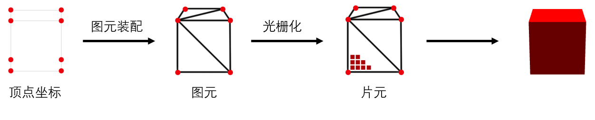

### 2. 基础概念

WebGL每次绘制需要两个着色器， 一个顶点着色器和一个片断着色器，每一个着色器都是一个方法。 一个顶点着色器和一个片断着色器链接在一起放入一个着色程序中（或者只叫程序）。 一个典型的WebGL应用会有多个着色程序。

#### 2.1. 顶点着色器

一个顶点着色器的工作是生成裁剪空间坐标值

```js
void main() {
   gl_Position = doMathToMakeClipspaceCoordinates
}
```

每个顶点调用一次（顶点）着色器，每次调用都需要设置一个特殊的全局变量gl_Position， 该变量的值就是裁减空间坐标值。  

顶点着色器需要的数据，可以通过以下三种方式获得。  

1. Attributes 属性 (从缓冲中获取的数据)  
2. Uniforms 全局变量 (在一次绘制中对所有顶点保持一致值)  
3. Textures 纹理 (从像素或纹理元素中获取的数据)  

##### 2.1.1. Attributes 属性

创建缓冲

```js
var buf = gl.createBuffer();
```

将数据存入缓冲

```js
gl.bindBuffer(gl.ARRAY_BUFFER, buf);
gl.bufferData(gl.ARRAY_BUFFER, someData, gl.STATIC_DRAW);
```

初始化的时候，在制作的（着色）程序中找到属性所在地址

```js
var positionLoc = gl.getAttribLocation(someShaderProgram, "a_position");
```

在渲染的时候告诉WebGL怎么从缓冲中获取数据传递给属性

```js
// 开启从缓冲中获取数据
gl.enableVertexAttribArray(positionLoc);
 
var numComponents = 3;  // (x, y, z)
var type = gl.FLOAT;    // 32位浮点数据
var normalize = false;  // 不标准化
var offset = 0;         // 从缓冲起始位置开始获取
var stride = 0;         // 到下一个数据跳多少位内存
                        // 0 = 使用当前的单位个数和单位长度 （ 3 * Float32Array.BYTES_PER_ELEMENT ）

// 绑定当前缓冲区范围到gl.ARRAY_BUFFER,成为当前顶点缓冲区对象的通用顶点属性并指定它的布局(缓冲区对象中的偏移量)。
gl.vertexAttribPointer(positionLoc, numComponents, type, false, stride, offset);
```

不做任何运算直接将数据传递给gl_Position。

```js
attribute vec4 a_position;
 
void main() {
   gl_Position = a_position;
}
```

如果缓冲中存的是裁剪空间坐标就没什么问题。  

属性可以用 float, vec2, vec3, vec4, mat2, mat3 和 mat4 数据类型。  

向量：  
vec   {2,3,4}     长度为2, 3, 4的float向量  
bvec {2,3,4}     长度为2, 3, 4的bool向量  
ivec  {2,3,4}     长度为2, 3, 4的int向量  
矩阵：  
mat2   2*2的浮点矩阵  
mat3   3*3的浮点矩阵  
mat4   4*4的浮点矩阵  

##### 2.1.2. Uniforms 全局变量

全局变量在一次绘制过程中传递给着色器的值都一样，在下面的一个简单的例子中， 用全局变量给顶点着色器添加了一个偏移量

```js
attribute vec4 a_position;
uniform vec4 u_offset;
 
void main() {
   gl_Position = a_position + u_offset;
}
```

把所有顶点偏移一个固定值，首先在初始化时找到全局变量的地址

```js
var offsetLoc = gl.getUniformLocation(someProgram, "u_offset");
```

然后在绘制前设置全局变量

```js
gl.uniform4fv(offsetLoc, [1, 0, 0, 0]);  // 向右偏移一半屏幕宽度
```

> 要注意的是全局变量属于单个着色程序，如果多个着色程序有同名全局变量，需要找到每个全局变量并设置自己的值。   

全局变量有很多类型，对应的类型有对应的设置方法。  

```js
gl.uniform1f (floatUniformLoc, v);                 // float
gl.uniform1fv(floatUniformLoc, [v]);               // float 或 float array
gl.uniform2f (vec2UniformLoc,  v0, v1);            // vec2
gl.uniform2fv(vec2UniformLoc,  [v0, v1]);          // vec2 或 vec2 array
gl.uniform3f (vec3UniformLoc,  v0, v1, v2);        // vec3
gl.uniform3fv(vec3UniformLoc,  [v0, v1, v2]);      // vec3 或 vec3 array
gl.uniform4f (vec4UniformLoc,  v0, v1, v2, v4);    // vec4
gl.uniform4fv(vec4UniformLoc,  [v0, v1, v2, v4]);  // vec4 或 vec4 array

gl.uniformMatrix2fv(mat2UniformLoc, false, [  4x element array ])  // mat2 或 mat2 array
gl.uniformMatrix3fv(mat3UniformLoc, false, [  9x element array ])  // mat3 或 mat3 array
gl.uniformMatrix4fv(mat4UniformLoc, false, [ 16x element array ])  // mat4 或 mat4 array

gl.uniform1i (intUniformLoc,   v);                 // int
gl.uniform1iv(intUniformLoc, [v]);                 // int 或 int array
gl.uniform2i (ivec2UniformLoc, v0, v1);            // ivec2
gl.uniform2iv(ivec2UniformLoc, [v0, v1]);          // ivec2 或 ivec2 array
gl.uniform3i (ivec3UniformLoc, v0, v1, v2);        // ivec3
gl.uniform3iv(ivec3UniformLoc, [v0, v1, v2]);      // ivec3 or ivec3 array
gl.uniform4i (ivec4UniformLoc, v0, v1, v2, v4);    // ivec4
gl.uniform4iv(ivec4UniformLoc, [v0, v1, v2, v4]);  // ivec4 或 ivec4 array

gl.uniform1i (sampler2DUniformLoc,   v);           // sampler2D (textures)
gl.uniform1iv(sampler2DUniformLoc, [v]);           // sampler2D 或 sampler2D array

gl.uniform1i (samplerCubeUniformLoc,   v);         // samplerCube (textures)
gl.uniform1iv(samplerCubeUniformLoc, [v]);         // samplerCube 或 samplerCube array
```

一个数组可以一次设置所有的全局变量，例如

```js
// 着色器里
uniform vec2 u_someVec2[3];

// JavaScript 初始化时
var someVec2Loc = gl.getUniformLocation(someProgram, "u_someVec2");

// 渲染的时候
gl.uniform2fv(someVec2Loc, [1, 2, 3, 4, 5, 6]);  // 设置数组 u_someVec2
```

想单独设置数组中的某个值，就要单独找到该值的地址。

```js
// JavaScript 初始化时
var someVec2Element0Loc = gl.getUniformLocation(someProgram, "u_someVec2[0]");
var someVec2Element1Loc = gl.getUniformLocation(someProgram, "u_someVec2[1]");
var someVec2Element2Loc = gl.getUniformLocation(someProgram, "u_someVec2[2]");

// 渲染的时候
gl.uniform2fv(someVec2Element0Loc, [1, 2]);  // set element 0
gl.uniform2fv(someVec2Element1Loc, [3, 4]);  // set element 1
gl.uniform2fv(someVec2Element2Loc, [5, 6]);  // set element 2
```

如果创建了一个结构体, 需要找到每个元素的地址

```js
struct SomeStruct {
  bool active;
  vec2 someVec2;
};
uniform SomeStruct u_someThing;

var someThingActiveLoc = gl.getUniformLocation(someProgram, "u_someThing.active");
var someThingSomeVec2Loc = gl.getUniformLocation(someProgram, "u_someThing.someVec2");
```

#### 2.2. 片断着色器

一个片断着色器的工作是为当前光栅化的像素提供颜色值，通常是以下的形式

```js
precision mediump float;

void main() {
   gl_FragColor = doMathToMakeAColor;
}
```

每个像素都将调用一次片断着色器，每次调用需要从你设置的特殊全局变量gl_FragColor中获取颜色信息。  

片断着色器所需的数据，可以通过以下三种方式获取  

Uniforms 全局变量  
Textures 纹理  
Varyings 可变量  

##### 2.2.1. Uniform 全局变量（片断着色器中）

同 Uniforms 全局变量.

##### 2.2.2. Textures 纹理（片断着色器中）

在着色器中获取纹理信息，可以先创建一个sampler2D类型全局变量，然后用GLSL方法texture2D 从纹理中提取信息。

```js
precision mediump float;

uniform sampler2D u_texture;

void main() {
   vec2 texcoord = vec2(0.5, 0.5)  // 获取纹理中心的值
   gl_FragColor = texture2D(u_texture, texcoord);
}
```

从纹理中获取的数据取决于很多设置。 至少要创建并给纹理填充数据，例如

```js
var tex = gl.createTexture();
gl.bindTexture(gl.TEXTURE_2D, tex);
var level = 0;
var width = 2;
var height = 1;
var data = new Uint8Array([
   255, 0, 0, 255,   // 一个红色的像素
   0, 255, 0, 255,   // 一个绿色的像素
]);
gl.texImage2D(gl.TEXTURE_2D, level, gl.RGBA, width, height, 0, gl.RGBA, gl.UNSIGNED_BYTE, data);


// 在初始化时找到全局变量的地址
var someSamplerLoc = gl.getUniformLocation(someProgram, "u_texture");

// 在渲染的时候WebGL要求纹理必须绑定到一个纹理单元上
var unit = 5;  // 挑选一个纹理单元
gl.activeTexture(gl.TEXTURE0 + unit);
gl.bindTexture(gl.TEXTURE_2D, tex);

// 诉着色器你要使用的纹理在那个纹理单元
gl.uniform1i(someSamplerLoc, unit);
```

##### 2.2.3. Varyings 可变量

可变量是一种顶点着色器给片断着色器传值的方式。  

为了使用可变量，要在两个着色器中定义同名的可变量。 给顶点着色器中可变量设置的值，会作为参考值进行内插，在绘制像素时传给片断着色器的可变量。  

```js
attribute vec4 a_position;

uniform vec4 u_offset;

varying vec4 v_positionWithOffset;

void main() {
  gl_Position = a_position + u_offset;
  v_positionWithOffset = a_position + u_offset;
}
```

#### 2.3. GLSL

全称是 Graphics Library Shader Language （图形库着色器语言），是着色器使用的语言.  

目的是为栅格化图形提供常用的计算功能。 所以它内建的数据类型例如vec2, vec3和 vec4分别代表两个值，三个值和四个值， 类似的还有mat2, mat3 和 mat4 分别代表 2x2, 3x3 和 4x4 矩阵。  

```js
// 常量和矢量的乘法。
vec4 a = vec4(1, 2, 3, 4);
vec4 b = a * 2.0;// b 现在是 vec4(2, 4, 6, 8);

// 做矩阵乘法以及矢量和矩阵的乘法
mat4 a = ???
mat4 b = ???
mat4 c = a * b;
 
vec4 v = ???
vec4 y = c * v;
```

为矢量数据提供多种分量选择器，例如 vec4

```js
vec4 v;

// v.x 和 v.s 以及 v.r ， v[0] 表达的是同一个分量。
// v.y 和 v.t 以及 v.g ， v[1] 表达的是同一个分量。
// v.z 和 v.p 以及 v.b ， v[2] 表达的是同一个分量。
// v.w 和 v.q 以及 v.a ， v[3] 表达的是同一个分量。


// 支持矢量调制，意味者你可以交换或重复分量。
// 是一样的
v.yyyy

vec4(v.y, v.y, v.y, v.y)

// 是一样的
vec4 m = mix(v1, v2, f);
vec4 m = vec4(
  mix(v1.x, v2.x, f),
  mix(v1.y, v2.y, f),
  mix(v1.z, v2.z, f),
  mix(v1.w, v2.w, f));
```

### 3. 常用api

1. gl.createShader——创建着色器对象  

```js
 const vertexShader = gl.createShader(gl.VERTEX_SHADER);
```

2. gl.shaderSource——设置 WebGLShader 着色器（顶点着色器及片元着色器）的GLSL程序代码  

```js
 const vertex = `
      attribute vec2 position;
      varying vec3 color;

      void main() {
        gl_PointSize = 1.0;
        color = vec3(0.5 + position * 0.5, 0.0);
        gl_Position = vec4(position * 0.5, 1.0, 1.0);
      }
    `;

    const fragment = `
      precision mediump float;
      varying vec3 color;

      void main()
      {
        gl_FragColor = vec4(color, 1.0);
      }    
    `;

    const vertexShader = gl.createShader(gl.VERTEX_SHADER);
    gl.shaderSource(vertexShader, vertex);
    gl.compileShader(vertexShader);

    const fragmentShader = gl.createShader(gl.FRAGMENT_SHADER);
    gl.shaderSource(fragmentShader, fragment);
     gl.compileShader(fragmentShader);
```

3. gl.compileShader——编译一个GLSL着色器，使其成为为二进制数据，然后就可以被WebGLProgram对象所使用.  

代码块见上  

4. gl.createProgram——创建和初始化一个 WebGLProgram 对象。  

```js
const program = gl.createProgram();
```

5. gl.attachShader——往 WebGLProgram 添加一个片段或者顶点着色器。  

```js
gl.attachShader(program, vertexShader);
    gl.attachShader(program, fragmentShader);
```

6. gl.linkProgram——链接给定的WebGLProgram，从而完成为程序的片元和顶点着色器准备GPU代码的过程。  

```js
gl.linkProgram(program);
```

7. gl.useProgram——将定义好的WebGLProgram 对象添加到当前的渲染状态中。  

```js
gl.useProgram(program);
```

8. gl.createBuffer——创建并初始化一个用于储存顶点数据或着色数据的WebGLBuffer对象
8. gl.createBuffer——创建并初始化一个用于储存顶点数据或着色数据的WebGLBuffer对象

```js
 const bufferId = gl.createBuffer();
 const bufferId = gl.createBuffer();
```

9. gl.bindBuffer——设置缓冲为当前使用缓冲  

```js
 gl.bindBuffer(gl.ARRAY_BUFFER, bufferId);
```

10. gl.bufferData——将数据拷贝到缓冲  

```js
 const points = new Float32Array([
      -1, -1,
      0, 1,
      1, -1,
    ]);
 gl.bufferData(gl.ARRAY_BUFFER, points, gl.STATIC_DRAW);
```

11. gl.getAttribLocation——返回了给定WebGLProgram对象中某属性的下标指向位置。  

```js
 const vPosition = gl.getAttribLocation(program, 'position');
 gl.vertexAttribPointer(vPosition, 2, gl.FLOAT, false, 0, 0);
 gl.enableVertexAttribArray(vPosition);
```

12. gl.vertexAttribPointer——诉显卡从当前绑定的缓冲区（bindBuffer()指定的缓冲区）中读取顶点数据  

```js
gl.vertexAttribPointer(index, size, type, normalized, stride, offset);
// index 指定要修改的顶点属性的索引。

// size 指定每个顶点属性的组成数量，必须是1，2，3或4...

// type指定数组中每个元素的数据类型可能是：
// gl.BYTE: signed 8-bit integer, with values in [-128, 127] 有符号的8位整数，范围[-128, 127]
// gl.SHORT: signed 16-bit integer, with values in [-32768, 32767] 有符号的16位整数，范围[-32768, 32767]
// gl.UNSIGNED_BYTE: unsigned 8-bit integer, with values in [0, 255] 无符号的8位整数，范围[0, 255]
// gl.UNSIGNED_SHORT: unsigned 16-bit integer, with values in [0, 65535] 无符号的16位整数，范围[0, 65535]
// gl.FLOAT: 32-bit IEEE floating point number 32位IEEE标准的浮点数
// 使用WebGL2版本的还可以使用以下值gl.HALF_FLOAT: 16-bit IEEE floating point number 16位IEEE标准的浮点数

// normalized 当转换为浮点数时是否应该将整数数值归一化到特定的范围。
// 对于类型gl.BYTE和gl.SHORT，如果是true则将值归一化为[-1, 1]
// 对于类型gl.UNSIGNED_BYTE和gl.UNSIGNED_SHORT，如果是true则将值归一化为[0, 1]
// 对于类型gl.FLOAT和gl.HALF_FLOAT，此参数无效

// stride  一个GLsizei，以字节为单位指定连续顶点属性开始之间的偏移量(即数组中一行长度)。不能大于255。如果stride为0，则假定该属性是紧密打包的，即不交错属性，每个属性在一个单独的块中，下一个顶点的属性紧跟当前顶点之后。

// offset GLintptr指定顶点属性数组中第一部分的字节偏移量。必须是类型的字节长度的倍数。

```

13. gl.enableVertexAttribArray——可以打开属性数组列表中指定索引处的通用顶点属性数组。通过disableVertexAttribArray()方法关闭顶点属性数组.  

代码块见上  

14. gl.clear——把指定的缓冲区清空为预设的值。  

```js
gl.clear(gl.COLOR_BUFFER_BIT);
```

15. gl.drawArrays——渲染数组中的原始数据。  

```js
gl.drawArrays(gl.TRIANGLES, 0, points.length / 2);
```

### 4. 仿射变换

仿射变换简单来说就是“线性变换 + 平移”  

1. 仿射变换前是直线段的，仿射变换后依然是直线段  

2. 对两条直线段 a 和 b 应用同样的仿射变换，变换前后线段长度比例保持不变  

#### 4.1. 向量的平移、旋转与缩放

常见的仿射变换形式包括平移、旋转、缩放以及它们的组合。其中，平移变换是最简单的仿射变换。如果我们想让向量 P(x0, y0) 沿着向量 Q(x1, y1) 平移，只要将 P 和 Q 相加就可以了。  

x=x0+x1  
y=y0+y1  

旋转变换  

```js
class Vector2D {
  ...  
  rotate(rad) {
    const c = Math.cos(rad),
      s = Math.sin(rad);
    const [x, y] = this;

    this.x = x * c + y * -s;
    this.y = x * s + y * c;

    return this;
  }
}
```

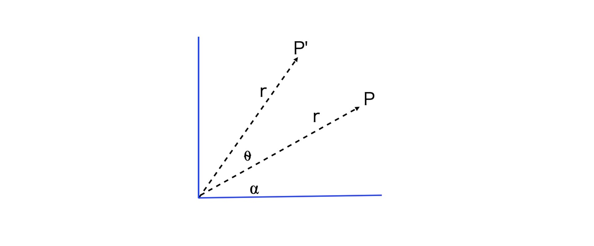

假设向量 P 的长度为 r，角度是⍺，现在我们要将它顺时针旋转⍬角，此时新的向量 P’的参数方程为：

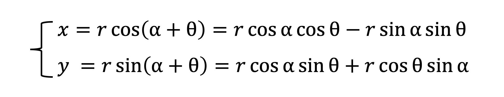

因为 rcos⍺、rsin⍺是向量 P 原始的坐标 x0、y0，所以，我们可以把坐标代入到上面的公式中，就会得到如下的公式：

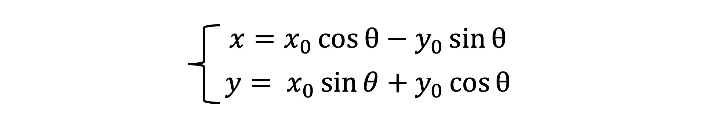

我们再将它写成矩阵形式，就会得到一个旋转矩阵。

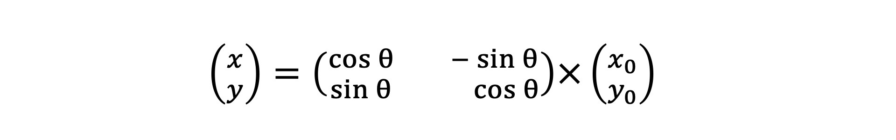

#### 4.2. 缩放变换

直接让向量与标量（标量只有大小、没有方向）相乘。  

x = sx x0  
y = sy y0  

#### 4.3. 仿射变换的应用：实现粒子动画

在一定时间内生成许多随机运动的小图形，这类动画通常是通过给人以视觉上的震撼，来达到获取用户关注的效果。  

粒子动画的运行效果，是从一个点开始发射出许多颜色、大小、角度各异的三角形，并且通过不断变化它们的位置，产生一种撒花般的视觉效果。  

##### 4.3.1. 创建三角形

定义三角形的顶点并将数据送到缓冲区

```js

const position = new Float32Array([
  -1, -1,
  0, 1,
  1, -1,
]);
const bufferId = gl.createBuffer();
gl.bindBuffer(gl.ARRAY_BUFFER, bufferId);
gl.bufferData(gl.ARRAY_BUFFER, position, gl.STATIC_DRAW);

const vPosition = gl.getAttribLocation(program, 'position');
gl.vertexAttribPointer(vPosition, 2, gl.FLOAT, false, 0, 0);
gl.enableVertexAttribArray(vPosition);
```

创建随机三角形属性  

```js

function randomTriangles() {
  const u_color = [Math.random(), Math.random(), Math.random(), 1.0]; // 随机颜色
  const u_rotation = Math.random() * Math.PI; // 初始旋转角度
  const u_scale = Math.random() * 0.05 + 0.03; // 初始大小
  const u_time = 0;
  const u_duration = 3.0; // 持续3秒钟

  const rad = Math.random() * Math.PI * 2;
  const u_dir = [Math.cos(rad), Math.sin(rad)]; // 运动方向
  const startTime = performance.now();

  return {u_color, u_rotation, u_scale, u_time, u_duration, u_dir, startTime};
}

```

##### 4.3.2. 设置 uniform 变量

uniform 声明的变量和其他语言中的常量一样，我们赋给 unform 变量的值在 shader 执行的过程中不可改变。而且一个变量的值是唯一的，不随顶点变化。uniform 变量既可以在顶点着色器中使用，也可以在片元着色器中使用。

```js

function setUniforms(gl, {u_color, u_rotation, u_scale, u_time, u_duration, u_dir}) {
  // gl.getUniformLocation 拿到uniform变量的指针
  let loc = gl.getUniformLocation(program, 'u_color');
  // 将数据传给 unfirom 变量的地址
  gl.uniform4fv(loc, u_color);

  loc = gl.getUniformLocation(program, 'u_rotation');
  gl.uniform1f(loc, u_rotation);

  loc = gl.getUniformLocation(program, 'u_scale');
  gl.uniform1f(loc, u_scale);

  loc = gl.getUniformLocation(program, 'u_time');
  gl.uniform1f(loc, u_time);

  loc = gl.getUniformLocation(program, 'u_duration');
  gl.uniform1f(loc, u_duration);

  loc = gl.getUniformLocation(program, 'u_dir');
  gl.uniform2fv(loc, u_dir);
}
```

顶点着色器中的 glsl 代码

```js

attribute vec2 position;

uniform float u_rotation;
uniform float u_time;
uniform float u_duration;
uniform float u_scale;
uniform vec2 u_dir;

varying float vP;

void main() {
  float p = min(1.0, u_time / u_duration);
  float rad = u_rotation + 3.14 * 10.0 * p;
  float scale = u_scale * p * (2.0 - p);
  vec2 offset = 2.0 * u_dir * p * p;
  mat3 translateMatrix = mat3(
    1.0, 0.0, 0.0,
    0.0, 1.0, 0.0,
    offset.x, offset.y, 1.0
  );
  mat3 rotateMatrix = mat3(
    cos(rad), sin(rad), 0.0,
    -sin(rad), cos(rad), 0.0,
    0.0, 0.0, 1.0
  );
  mat3 scaleMatrix = mat3(
    scale, 0.0, 0.0,
    0.0, scale, 0.0,
    0.0, 0.0, 1.0
  );
  gl_PointSize = 1.0;
  vec3 pos = translateMatrix * rotateMatrix * scaleMatrix * vec3(position, 1.0);
  gl_Position = vec4(pos, 1.0);
  vP = p;
}
```

在片元着色器中着色

```js

 precision mediump float;
  uniform vec4 u_color;
  varying float vP;

  void main()
  {
    gl_FragColor.xyz = u_color.xyz;
    gl_FragColor.a = (1.0 - vP) * u_color.a;
  }  
```

##### 4.4.3. 用 requestAnimationFrame 实现动画

```js

let triangles = [];

function update() {
  for(let i = 0; i < 5 * Math.random(); i++) {
    triangles.push(randomTriangles());
  }
  gl.clear(gl.COLOR_BUFFER_BIT);
  // 对每个三角形重新设置u_time
  triangles.forEach((triangle) => {
    triangle.u_time = (performance.now() - triangle.startTime) / 1000;
    setUniforms(gl, triangle);
    gl.drawArrays(gl.TRIANGLES, 0, position.length / 2);
  });
  // 移除已经结束动画的三角形
  triangles = triangles.filter((triangle) => {
    return triangle.u_time <= triangle.u_duration;
  });
  requestAnimationFrame(update);
}

requestAnimationFrame(update);
```

### 5. 绘制重复图案

#### 5.1. 使用 background-image 来绘制重复图案

```css
canvas {
  background-image: linear-gradient(to right, transparent 90%, #ccc 0),
    linear-gradient(to bottom, transparent 90%, #ccc 0);
  background-size: 8px 8px, 8px 8px;
}
```

利用浏览器自己的 background-repeat 机制，就可以实现网格背景。

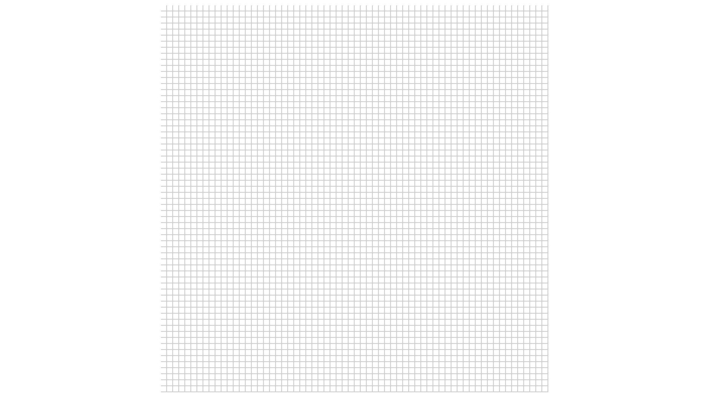

#### 5.2. 使用 Shader 来绘制重复图案

利用 GPU 并行计算的特点，使用着色器来绘制背景网格这样的重复图案。

```js

//顶点着色器:

attribute vec2 a_vertexPosition;
attribute vec2 uv;
varying vec2 vUv;


void main() {
  gl_PointSize = 1.0;
  vUv = uv;
  gl_Position = vec4(a_vertexPosition, 1, 1);


//片元着色器:


#ifdef GL_ES
precision mediump float;
#endif
varying vec2 vUv;
uniform float rows;

void main() {
  vec2 st = fract(vUv * rows);
  float d1 = step(st.x, 0.9);
  float d2 = step(0.1, st.y);
  gl_FragColor.rgb = mix(vec3(0.8), vec3(1.0), d1 * d2);
  gl_FragColor.a = 1.0;
}

```

一个基础库gl-renderer。gl-renderer 在 WebGL 底层的基础上进行了一些简单的封装，以便于我们将重点放在提供几何数据、设置变量和编写 Shader 上，不用因为创建 buffer 等细节而分心。  

```js

//第一步: 创建 Renderer 对象
const canvas = document.querySelector('canvas');
const renderer = new GlRenderer(canvas);

//第二步: 创建并启用 WebGL 程序
const program = renderer.compileSync(fragment, vertex);
renderer.useProgram(program);

//第三步: 设置 uniform 变量
renderer.uniforms.rows = 64;

//第四步: 将顶点数据送入缓冲区。

renderer.setMeshData([{
  positions: [
    [-1, -1],
    [-1, 1],
    [1, 1],
    [1, -1],
  ],
  attributes: {
    uv: [
      [0, 0],
      [0, 1],
      [1, 1],
      [1, 0],
    ],
  },
  cells: [[0, 1, 2], [2, 0, 3]],
}]);

```

## three.js

Three.js是基于原生WebGL封装运行的三维引擎  


黄色和绿色部分，都是three.js参与的部分，其中黄色是javascript部分，绿色是opengles部分。  

- 辅助我们导出了模型数据；
- 自动生成了各种矩阵；
- 生成了顶点着色器；
- 辅助我们生成材质，配置灯光；
- 根据我们设置的材质生成了片元着色器。
- 而且将webGL基于光栅化的2D API，封装成了我们人类能看懂的 3D API。


### 1. 程序结构

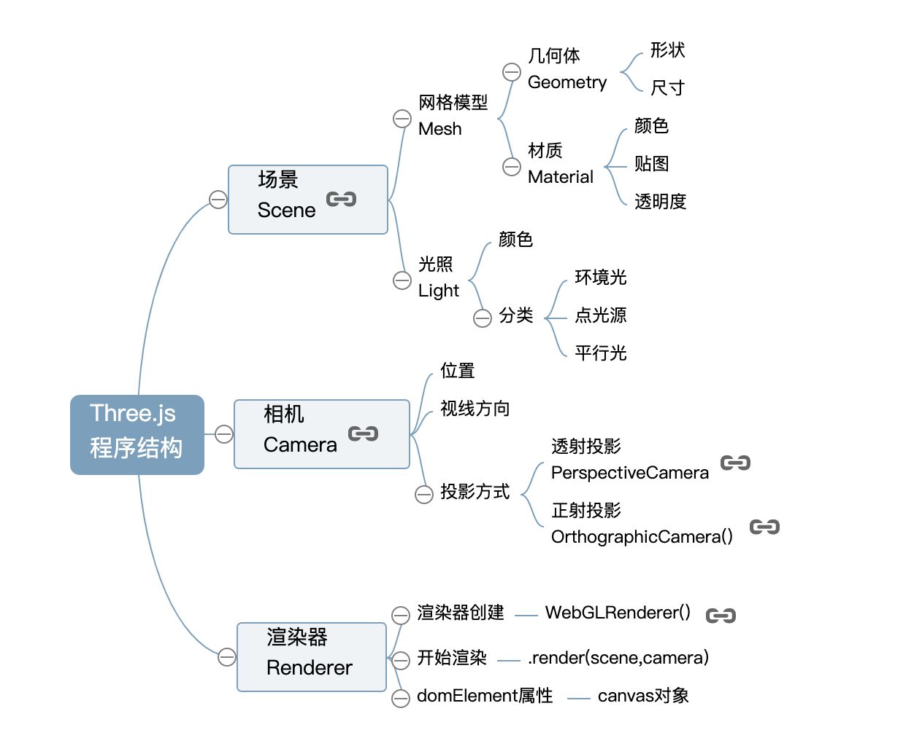

demo1 创建一个立方体

```js
// 创建场景对象Scene
const scene = new THREE.Scene();

// 创建网格模型
const geometry = new THREE.BoxGeometry(100, 100, 100); //创建一个立方体几何对象Geometry
const material = new THREE.MeshLambertMaterial({
  color: 0x0000ff
});

//材质对象Material
const mesh = new THREE.Mesh(geometry, material); //网格模型对象Mesh
scene.add(mesh); //网格模型添加到场景中

// 光源设置
//点光源
const point = new THREE.PointLight(0xffffff);
point.position.set(400, 200, 300); //点光源位置
scene.add(point); //点光源添加到场景中

//环境光
const ambient = new THREE.AmbientLight(0x444444);
scene.add(ambient);

// 相机设置
const width = window.innerWidth; //窗口宽度
const height = window.innerHeight; //窗口高度
const k = width / height; //窗口宽高比
const s = 200; //三维场景显示范围控制系数，系数越大，显示的范围越大

//创建相机对象
const camera = new THREE.OrthographicCamera(-s * k, s * k, s, -s, 1, 1000);
camera.position.set(200, 300, 200); //设置相机位置
camera.lookAt(scene.position); //设置相机方向(指向的场景对象)

// 创建渲染器对象
const renderer = new THREE.WebGLRenderer();
renderer.setSize(width, height); //设置渲染区域尺寸
renderer.setClearColor(0xb9d3ff, 1); //设置背景颜色
document.body.appendChild(renderer.domElement); //body元素中插入canvas对象

//执行渲染操作   指定场景、相机作为参数
renderer.render(scene, camera);
```

#### 1.1. 材质Material

代码var material=new THREE.MeshLambertMaterial({color:0x0000ff});通过构造函数THREE.MeshLambertMaterial()创建了一个可以用于立方体的材质对象， 构造函数的参数是一个对象，对象包含了颜色、透明度等属性，本案例中只定义了颜色color，颜色属性值0x0000ff表示蓝色，可以把颜色值改为0x00ff00，可以看到是绿色的立方体效果， 这里使用的颜色值表示方法是16进制RGB三原色模型。 

##### 材质属性

color 材质颜色，比如蓝色0x0000ff  
wireframe 将几何图形渲染为线框。 默认值为false  
opacity 透明度设置，0表示完全透明，1表示完全不透明  
transparent 是否开启透明，默认false  

```js
// 半透明效果
var sphereMaterial=new THREE.MeshLambertMaterial({
    color:0xff0000,
    opacity:0.7,
    transparent:true
});
```

##### 添加高光效果

处在光照条件下的物体表面会发生光的反射现象，不同的表面粗糙度不同，宏观上来看对光的综合反射效果，可以使用两个反射模型来概括，一个是漫反射，一个是镜面反射， 使用渲染软件或绘画的时候都会提到一个高光的概念，其实说的就是物理光学中镜面反射产生的局部高亮效果。  

对于three.js而言漫反射、镜面反射分别对应两个构造函数MeshLambertMaterial()、MeshPhongMaterial(),通过three.js引擎你可以很容易实现这些光照模型，不需要自己再使用原生WebGL实现  

```js
// 添加高光效果
var sphereMaterial=new THREE.MeshPhongMaterial({
    color:0x0000ff,
    specular:0x4488ee,
    shininess:12
});
```

#### 1.2. 光源Light

代码var point=new THREE.PointLight(0xffffff);通过构造函数THREE.PointLight()创建了一个点光源对象，参数0xffffff定义的是光照强度， 你可以尝试把参数更改为为0x444444，刷新浏览器你会看到立方体的表面颜色变暗，这很好理解，实际生活中灯光强度变低了，周围的景物自然暗淡，three.js引擎对WebGL光照模型算法都进行了封装.  

##### 常见光源类型

AmbientLight 环境光  
PointLight 点光源  
DirectionalLight 平行光，比如太阳光  
SpotLight 聚光源  

```js
// 环境光    环境光颜色与网格模型的颜色进行RGB进行乘法运算
var ambient = new THREE.AmbientLight(0x444444);
scene.add(ambient);
```

```js
//点光源
var point = new THREE.PointLight(0xffffff);
point.position.set(400, 200, 300); //点光源位置
// 通过add方法插入场景中，不插入的话，渲染的时候不会获取光源的信息进行光照计算
scene.add(point); //点光源添加到场景中
```

#### 1.3. 相机Camera

代码var camera = new THREE.OrthographicCamera(-s * k, s * k, s, -s, 1, 1000);通过构造函数THREE.OrthographicCamera()创建了一个正射投影相机对象， 把该构造函数参数中用到的参数s，也就是代码var s = 200;中定义的一个系数，可以把200更改为300,你会发现立方体显示效果变小，这很好理解，相机构造函数的的前四个参数定义的是拍照窗口大小， 就像平时拍照一样，取景范围为大，被拍的人相对背景自然变小了。  
camera.position.set(200, 300, 200);和camera.lookAt(scene.position);定义的是相机的位置和拍照方向，可以更改camera.position.set(200,300,200);参数重新定义的相机位置，把第一个参数也就是x坐标从200更改为250， 你会发现立方的在屏幕上呈现的角度变了，这就像你生活中拍照人是同一个人，但是你拍照的位置角度不同，显示的效果肯定不同。  

#### 1.4. 鼠标操作三维场景

为了使用鼠标操作三维场景，可以借助three.js众多控件之一OrbitControls.js，可以在下载的three.js-master文件中找到(three.js-master\examples\js\controls)。  

OrbitControls.js控件支持鼠标左中右键操作和键盘方向键操作，具体代码如下，使用下面的代码替换前面demo中renderer.render(scene,camera)即可。  

```js
function render() {
  renderer.render(scene,camera);//执行渲染操作
}
render();
var controls = new THREE.OrbitControls(camera,renderer.domElement);//创建控件对象
controls.addEventListener('change', render);//监听鼠标、键盘事件
```

OrbitControls.js控件提供了一个构造函数THREE.OrbitControls()，把一个相机对象作为参数的时候，执行代码new THREE.OrbitControls(camera,renderer.domElement)，浏览器会自动检测鼠标键盘的变化， 并根据鼠标和键盘的变化更新相机对象的参数，比如你拖动鼠标左键，浏览器会检测到鼠标事件，把鼠标平移的距离按照一定算法转化为相机的的旋转角度，你可以联系生活中相机拍照,即使景物没有变化，你的相机拍摄角度发生了变化，自然渲染器渲染出的结果就变化了，通过定义监听事件controls.addEventListener('change', render)，如果你连续操作鼠标，相机的参数不停的变化，同时会不停的调用渲染函数render()进行渲染，这样threejs就会使用相机新的位置或角度数据进行渲染。  

### 2. 几何体顶点

几何体API  

访问几何体顶点位置数据  BufferGeometry.attributes.position  
访问几何体顶点颜色数据  BufferGeometry.attributes.color  
访问几何体顶点法向量数据  BufferGeometry.attributes.normal  

#### 2.1. 顶点位置数据解析渲染

通过Threejs引擎的BufferGeometry和BufferAttribute两个API自定义了一个具有六个顶点数据的几何体。  

```js
var geometry = new THREE.BufferGeometry(); //创建一个Buffer类型几何体对象
//类型数组创建顶点数据
var vertices = new Float32Array([
  0, 0, 0, //顶点1坐标
  50, 0, 0, //顶点2坐标
  0, 100, 0, //顶点3坐标
  0, 0, 10, //顶点4坐标
  0, 0, 100, //顶点5坐标
  50, 0, 10, //顶点6坐标
]);
// 创建属性缓冲区对象
var attribue = new THREE.BufferAttribute(vertices, 3); //3个为一组，表示一个顶点的xyz坐标
// 设置几何体attributes属性的位置属性
geometry.attributes.position = attribue;
```

##### 点模型Points

可以把几何体geometry作为点模型Points而不是网格模型Mesh的参数，你会发现上面的六个点坐标会渲染为六个方形的点区域.

```js
// 点渲染模式
var material = new THREE.PointsMaterial({
  color: 0xff0000,
  size: 10.0 //点对象像素尺寸
}); //材质对象
var points = new THREE.Points(geometry, material); //点模型对象
scene.add(points); //点对象添加到场景中
```

##### 线模型Line

```js
// 线条渲染模式
var material=new THREE.LineBasicMaterial({
    color:0xff0000 //线条颜色
});//材质对象
var line=new THREE.Line(geometry,material);//线条模型对象
scene.add(line);//线条对象添加到场景中
```

#### 2.2. 顶点颜色数据插值计算

##### 每个顶点设置一种颜色

几何体的六个顶点分别渲染为几何体设置的顶点颜色数据。

```js
var geometry = new THREE.BufferGeometry(); //声明一个缓冲几何体对象

//类型数组创建顶点位置position数据
var vertices = new Float32Array([
  0, 0, 0, //顶点1坐标
  50, 0, 0, //顶点2坐标
  0, 100, 0, //顶点3坐标

  0, 0, 10, //顶点4坐标
  0, 0, 100, //顶点5坐标
  50, 0, 10, //顶点6坐标
]);
// 创建属性缓冲区对象
var attribue = new THREE.BufferAttribute(vertices, 3); //3个为一组，作为一个顶点的xyz坐标
// 设置几何体attributes属性的位置position属性
geometry.attributes.position = attribue;
//类型数组创建顶点颜色color数据
var colors = new Float32Array([
  1, 0, 0, //顶点1颜色
  0, 1, 0, //顶点2颜色
  0, 0, 1, //顶点3颜色

  1, 1, 0, //顶点4颜色
  0, 1, 1, //顶点5颜色
  1, 0, 1, //顶点6颜色
]);
// 设置几何体attributes属性的颜色color属性
geometry.attributes.color = new THREE.BufferAttribute(colors, 3); //3个为一组,表示一个顶点的颜色数据RGB
//材质对象
var material = new THREE.PointsMaterial({
  vertexColors: THREE.VertexColors, //以顶点颜色为准
  size: 10.0 //点对象像素尺寸
});
// 点渲染模式  点模型对象Points
var points = new THREE.Points(geometry, material); //点模型对象
scene.add(points); //点对象添加到场景
```

#### 2.3. 顶点法向量数据光照计算

WebGL中为了计算光线与物体表面入射角，你首先要计算物体表面每个位置的法线方向，在Threejs中表示物体的网格模型Mesh的曲面是由一个一个三角形构成，所以为了表示物体表面各个位置的法线方向，可以给几何体的每个顶点定义一个方向向量。

```js
var normals = new Float32Array([
  0, 0, 1, //顶点1法向量
  0, 0, 1, //顶点2法向量
  0, 0, 1, //顶点3法向量

  0, 1, 0, //顶点4法向量
  0, 1, 0, //顶点5法向量
  0, 1, 0, //顶点6法向量
]);
// 设置几何体attributes属性的位置normal属性
geometry.attributes.normal = new THREE.BufferAttribute(normals, 3); //3个为一组,表示一个顶点的法向量数据
```

#### 2.4. 顶点索引复用顶点数据

比如绘制一个矩形网格模型,至少需要两个三角形拼接而成，两个三角形，每个三角形有三个顶点，也就是说需要定义6个顶点位置数据。对于矩形网格模型而言，两个三角形有两个顶点位置是重合的。也就是说可以重复的位置可以定义一次，然后通过通过顶点数组的索引值获取这些顶点位置数据。  

##### 顶点索引.index

通过几何体BufferGeometry的顶点索引BufferGeometry.index定义了一个矩形。通过顶点索引组织网格模型三角形的绘制，因为矩形的两个三角形有两个顶点位置重复，所以顶点位置数据、顶点法向量数据都只需要定义4个就可以。

```js
ar geometry = new THREE.BufferGeometry(); //声明一个空几何体对象
//类型数组创建顶点位置position数据
var vertices = new Float32Array([
  0, 0, 0, //顶点1坐标
  80, 0, 0, //顶点2坐标
  80, 80, 0, //顶点3坐标
  0, 80, 0, //顶点4坐标
]);
// 创建属性缓冲区对象
var attribue = new THREE.BufferAttribute(vertices, 3); //3个为一组
// 设置几何体attributes属性的位置position属性
geometry.attributes.position = attribue
var normals = new Float32Array([
  0, 0, 1, //顶点1法向量
  0, 0, 1, //顶点2法向量
  0, 0, 1, //顶点3法向量
  0, 0, 1, //顶点4法向量
]);
// 设置几何体attributes属性的位置normal属性
geometry.attributes.normal = new THREE.BufferAttribute(normals, 3); //3个为一组,表示一个顶点的xyz坐标
```

通过顶点索引组织顶点数据，顶点索引数组indexes通过索引值指向顶点位置geometry.attributes.position、顶点法向量geometry.attributes.normal中顶面数组。

```js
// Uint16Array类型数组创建顶点索引数据
var indexes = new Uint16Array([
  // 0对应第1个顶点位置数据、第1个顶点法向量数据
  // 1对应第2个顶点位置数据、第2个顶点法向量数据
  // 索引值3个为一组，表示一个三角形的3个顶点
  0, 1, 2,
  0, 2, 3,
])
// 索引数据赋值给几何体的index属性
geometry.index = new THREE.BufferAttribute(indexes, 1); //1个为一组
```

| 类型数组 | 位数 | 字节 | 类型描述 |
| Int8Array | 8 | 1 | 有符号8位整型 |
| Uint8Array | 8 | 1 | 无符号8位整型 |
| Int16Array | 16 | 2 | 有符号16位整型 |
| Uint16Array | 16 | 2 | 无符号16位整型 |
| Int32Array | 32 | 4 | 有符号32位整型 | int32_t |
| Uint32Array | 32 | 4 | 无符号32位整型 | uint32_t |
| Float32Array | 32 | 4 | 单精度(32位)浮点数 | float |
| Float64Array | 64 | 8 | 双精度(64位)浮点数 | double |

#### 2.5. Face3对象定义Geometry的三角形面

几何体Geometry的三角面属性geometry.faces和缓冲类型几何体BufferGeometry顶点索引属性BufferGeometry.index类似都是顶点位置数据的索引值,用来组织网格模型三角形的绘制。  

通过Face3构建一个三角形，不要设置顶点位置坐标数据，只需要通过数组索引值从geometry.vertices数组中获得顶点位置坐标数据。  

geometry.vertices数组索引0, 1, 2对应的顶点位置坐标数据表示三角形1的三个顶点坐标，索引0, 2, 3对应的顶点位置坐标数据表示三角形2的三个顶点坐标。  

```js
// Face3构造函数创建一个三角面
var face1 = new THREE.Face3(0, 1, 2);
// 三角面2
var face2 = new THREE.Face3(0, 2, 3);
```

##### 三角形法线设置

网格模型Mesh的几何体Geometry本质上都是一个一个三角形拼接而成，所以可以通过设置三角形的法线方向向量来表示几何体表面各个位置的法线方向向量。  

设置三角形法线方向向量有两种方式，一种是直接定义三角形面的法线方向，另一个是定义三角形三个顶点的法线方向数据来表示三角形面法线方向。  

使用三维向量THREE.Vector3表示三角形法线方向数值，然后赋值给三角形对象Face3的法线属性Face3.normal。  

```js
// 三角面2
var face2 = new THREE.Face3(0, 2, 3);
// 设置三角面法向量
face2.normal=new THREE.Vector3(0, -1, 0);
```

换另一种方式，通过三角形面Face3的Face3.vertexNormals属性给三角形的三个顶点分别设置一个顶点法线方向数据。

```js
// Face3构造函数创建一个三角面
var face1 = new THREE.Face3(0, 1, 2);
//三角面每个顶点的法向量
var n1 = new THREE.Vector3(0, 0, -1); //三角面Face1顶点1的法向量
var n2 = new THREE.Vector3(0, 0, -1); //三角面2Face2顶点2的法向量
var n3 = new THREE.Vector3(0, 0, -1); //三角面3Face3顶点3的法向量
// 设置三角面Face3三个顶点的法向量
face1.vertexNormals.push(n1,n2,n3);
```

##### 三角形颜色设置

三角形颜色设置和三角形法线方向设置类型，可以直接设置三角形颜色，也可以设置三角形三个顶点的颜色。

```js
// 三角形1颜色
face1.color = new THREE.Color(0xffff00);
// 设置三角面face1三个顶点的颜色
face1.color = new THREE.Color(0xff00ff);
```

三个顶点颜色不同三角形面渲染的时候会进行颜色插值计算，测到一个颜色渐变效果。

```js
face1.vertexColors = [
  new THREE.Color(0xffff00),
  new THREE.Color(0xff00ff),
  new THREE.Color(0x00ffff),
]
```

#### 2.6. 访问几何体对象的数据

调用BoxGeometry创建一个立方体，执行THREE.BoxGeometry构造函数会自动生成几何体对象的顶点位置坐标、顶点法向量等数据。

```js
var geometry = new THREE.BoxGeometry(100, 100, 100); //创建一个立方体几何对象Geometry
console.log(geometry);
console.log('几何体顶点位置数据',geometry.vertices);
console.log('三角行面数据',geometry.faces);
```

```js
//创建一个矩形平面几何体
var geometry = new THREE.PlaneBufferGeometry(100, 100);
console.log(geometry);
console.log('几何体顶点位置数据',geometry.attributes.position);
console.log('几何体索引数据',geometry.index);
```

#### 2.7. 几何体旋转、缩放、平移变换


通过.scale()、.translate()、.rotateX()等方法可以对几何体本身进行缩放、平移、旋转等几何变换。这些方法对几何体进行变换，注意本质上都是改变结合体顶点位置坐标数据。  

```js
var geometry = new THREE.BoxGeometry(100, 100, 100); //创建一个立方体几何对象Geometry
// 几何体xyz三个方向都放大2倍
geometry.scale(2, 2, 2);
// 几何体沿着x轴平移50
geometry.translate(50, 0, 0);
// 几何体绕着x轴旋转45度
geometry.rotateX(Math.PI / 4);
// 居中：偏移的几何体居中
geometry.center();
console.log(geometry.vertices)
```

> 注意网格模型Mesh进行缩放旋转平移变换和几何体Geometry可以实现相同的渲染效果，但是网格模型Mesh进行这些变换不会影响几何体的顶点位置坐标，网格模型缩放旋转平移变换改变的是模型的本地矩阵、世界矩阵。  

```js
// 几何体xyz方向分别缩放0.5,1.5,2倍
geometry.scale(0.5, 1.5, 2);

// 网格模型xyz方向分别缩放0.5,1.5,2倍
mesh.scale.set(0.5, 1.5, 2)
```

### 3. 材质

所有材质就是对WebGL着色器代码的封装

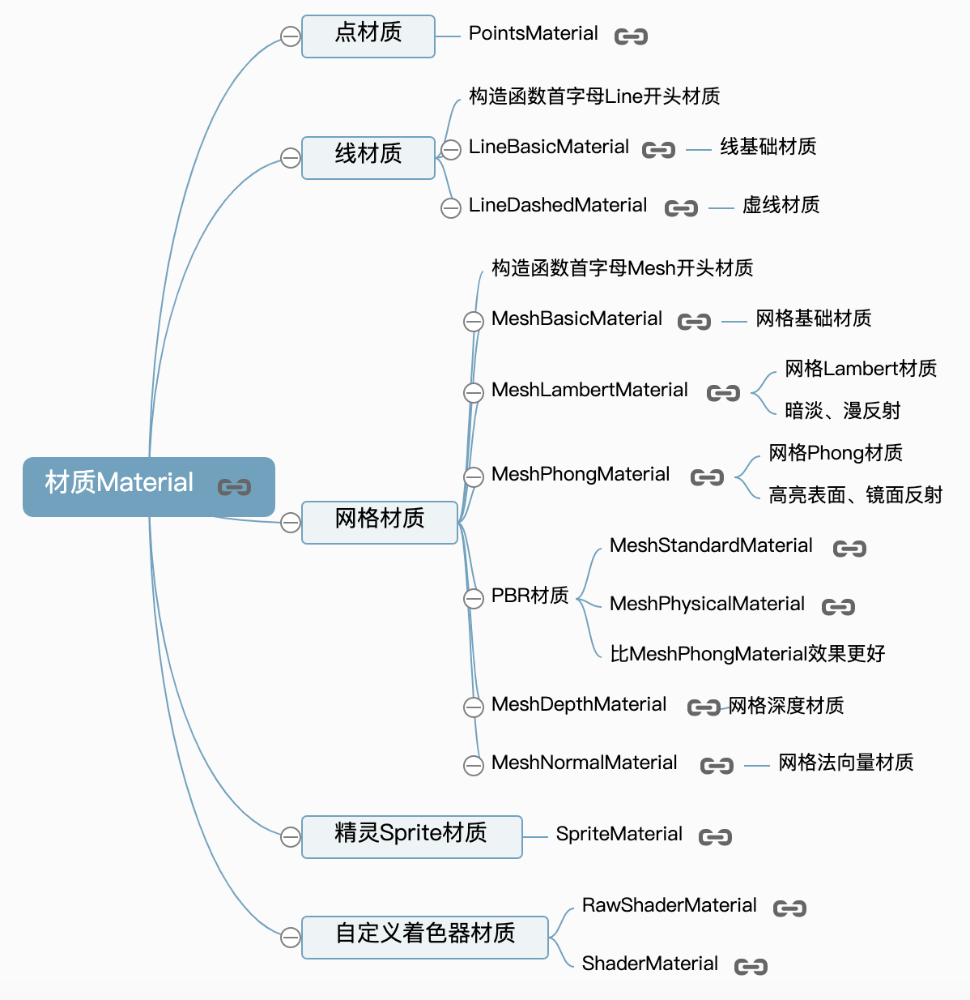

#### 3.1. 点材质PointsMaterial

点材质PointsMaterial的.size属性可以每个顶点渲染的方形区域尺寸像素大小。

```js
var geometry = new THREE.SphereGeometry(100, 25, 25); //创建一个球体几何对象
// 创建一个点材质对象
var material = new THREE.PointsMaterial({
  color: 0x0000ff, //颜色
  size: 3, //点渲染尺寸
});
//点模型对象  参数：几何体  点材质
var point = new THREE.Points(geometry, material);
scene.add(point); //网格模型添加到场景中
```

#### 3.2. 线材质

线材质有基础线材质LineBasicMaterial和虚线材质LineDashedMaterial两个，通常使用使用Line等线模型才会用到线材质。

```js
var geometry = new THREE.SphereGeometry(100, 25, 25);//球体
// 直线基础材质对象
var material = new THREE.LineBasicMaterial({
  color: 0x0000ff
});
var line = new THREE.Line(geometry, material); //线模型对象
scene.add(line); //点模型添加到场景中


// 虚线材质对象：产生虚线效果
var material = new THREE.LineDashedMaterial({
  color: 0x0000ff,
  dashSize: 10,//显示线段的大小。默认为3。
  gapSize: 5,//间隙的大小。默认为1
});
var line = new THREE.Line(geometry, material); //线模型对象
//  computeLineDistances方法  计算LineDashedMaterial所需的距离数组
line.computeLineDistances();
```

#### 3.3. 网格材质

网格类模型才会使用的材质对象。

```js
// 基础网格材质对象MeshBasicMaterial,不受带有方向光源影响，没有棱角感。
var material = new THREE.MeshBasicMaterial({
  color: 0x0000ff,
})


// MeshLambertMaterial材质可以实现网格Mesh表面与光源的漫反射光照计算，有了光照计算，物体表面分界的位置才会产生棱角感。
var material = new THREE.MeshLambertMaterial({
  color: 0x00ff00,
});

// 高光网格材质MeshPhongMaterial除了和MeshLambertMaterial一样可以实现光源和网格表面的漫反射光照计算，还可以产生高光效果(镜面反射)。
var material = new THREE.MeshPhongMaterial({
  color: 0xff0000,
  specular:0x444444,//高光部分的颜色
  shininess:20,//高光部分的亮度，默认30
});
```

#### 3.4. 材质和模型对象对应关系

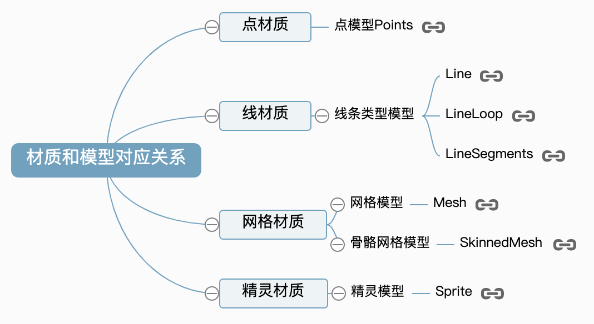

#### 3.5. .side属性

.side属性的属性值定义面的渲染方式前面后面 或 双面. 属性的默认值是THREE.FrontSide，表示前面. 也可以设置为后面THREE.BackSide 或 双面THREE.DoubleSide.

```js
var material = new THREE.MeshBasicMaterial({
  color: 0xdd00ff,
  // 前面FrontSide  背面：BackSide 双面：DoubleSide
  side:THREE.DoubleSide,
});
```

#### 3.6. 材质透明度.opacity

通过材质的透明度属性.opacity可以设置材质的透明程度，.opacity属性值的范围是0.0~1.0，0.0值表示完全透明, 1.0表示完全不透明，.opacity默认值1.0。  
当设置.opacity属性值的时候，需要设置材质属性transparent值为true，如果材质的transparent属性没设置为true, 材质会保持完全不透明状态。

```js
// 在构造函数参数中设置transparent和.opacity的属性值
var material = new THREE.MeshPhongMaterial({
  color: 0x220000,
  // transparent设置为true，开启透明，否则opacity不起作用
  transparent: true,
  // 设置材质透明度
  opacity: 0.4,
});


//通过访问材质对象属性形式设置transparent和.opacity的属性值
  // transparent设置为true，开启透明，否则opacity不起作用
material.transparent = true;
  // 设置材质透明度
material.opacity = 0.4;
```

### 4. 点、线、网格模型

点模型Points、线模型Line、网格网格模型Mesh都是由几何体Geometry和材质Material构成，这三种模型的区别在于对几何体顶点数据的渲染方式不同

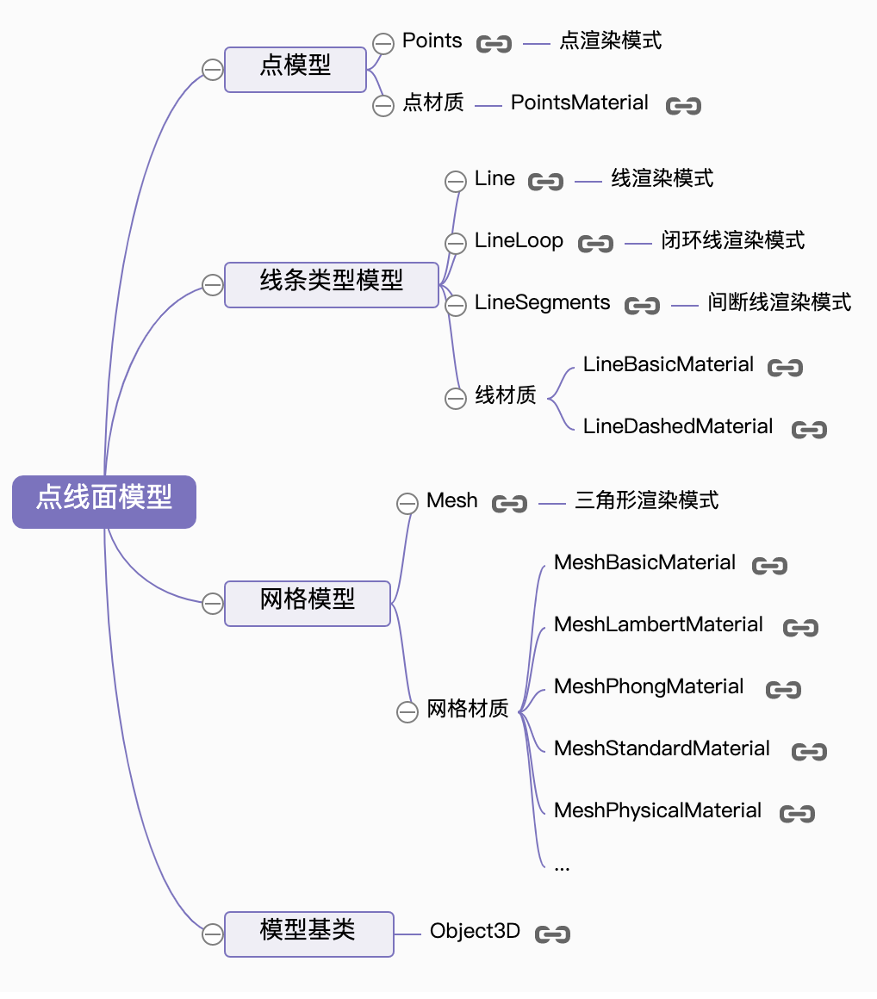

#### 4.1. 点模型Points

点模型Points就是几何体的每一个顶点数据渲染为一个方形区域，方形区域的大小可以设置。

```js
var geometry = new THREE.BoxGeometry(100, 100, 100); //创建一个立方体几何对象Geometry
// 点渲染模式
var material = new THREE.PointsMaterial({
  color: 0xff0000,
  size: 5.0 //点对象像素尺寸
}); //材质对象
var points = new THREE.Points(geometry, material); //点模型对象
```

#### 4.2. 线模型Line

两点确定一条直线，线模型Line就是使用线条去连接几何体的顶点数据。  

线模型除了Line还有LineLoop和LineSegments,LineLoop和Line区别是连线的时候会闭合把第一个顶点和最后一个顶点连接起来，LineSegments则是顶点不共享，第1、2点确定一条线，第3、4顶点确定一条直线，第2和3点之间不连接。  

```js
var geometry = new THREE.BoxGeometry(100, 100, 100); //创建一个立方体几何对象Geometry
// 线条渲染模式
var material=new THREE.LineBasicMaterial({
    color:0xff0000 //线条颜色
});//材质对象
// 创建线模型对象   构造函数：Line、LineLoop、LineSegments
var line=new THREE.Line(geometry,material);//线条模型对象
```

#### 4.3. 网格模型Mesh

三个顶点确定一个三角形，网格模型Mesh默认的情况下，通过三角形面绘制渲染几何体的所有顶点，通过一系列的三角形拼接出来一个曲面。

```js
var geometry = new THREE.BoxGeometry(100, 100, 100);
// 三角形面渲染模式  
var material = new THREE.MeshLambertMaterial({
  color: 0x0000ff, //三角面颜色
}); //材质对象
var mesh = new THREE.Mesh(geometry, material); //网格模型对象Mesh
```

如果设置网格模型的wireframe属性为true，所有三角形会以线条形式绘制出来.

```js
var material = new THREE.MeshLambertMaterial({
  color: 0x0000ff, //三角面颜色
  wireframe:true,//网格模型以线条的模式渲染
});

// 通过访问属性的形式设置
material.wireframe = true;
```

#### 4.4. 对象克隆.clone()和复制.copy()

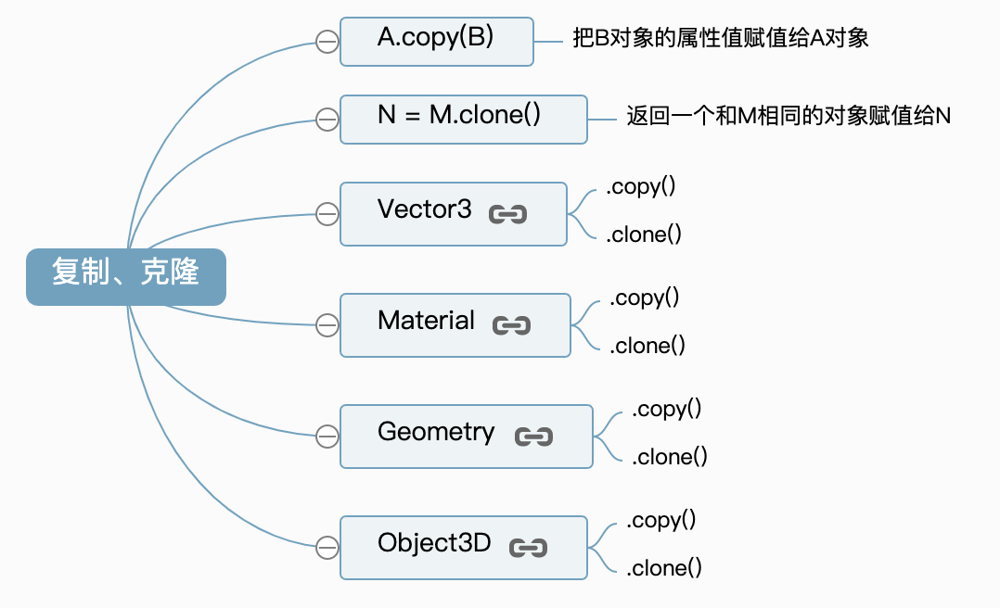

1. 复制方法.copy()  

A.copy(B)表示B属性的值赋值给A对应属性。  

```js
var p1 = new THREE.Vector3(1.2,2.6,3.2);
var p2 = new THREE.Vector3(0.0,0.0,0.0);
p2.copy(p1)
// p2向量的xyz变为p1的xyz值
console.log(p2);
```

2. 克隆方法.clone()  

N = M.copy()表示返回一个和M相同的对象赋值给N。  

```js
var p1 = new THREE.Vector3(1.2,2.6,3.2);
var p2 = p1.clone();
// p2对象和p1对象xyz属性相同
console.log(p2);
```

3. 网格模型复制和克隆  

网格模型复制克隆和三维向量基本逻辑是相同，但是注意三维向量Vector3的.x、.y、.z属性值是数字，也就是说是基本类型的数据，对于网格模型而言，网格模型对象的几何体属性mesh.geometry和材质属性mesh.material的属性值都是对象的索引值。  

```js
var box=new THREE.BoxGeometry(10,10,10);//创建一个立方体几何对象
var material=new THREE.MeshLambertMaterial({color:0x0000ff});//材质对象


var mesh=new THREE.Mesh(box,material);//网格模型对象
var mesh2 = mesh.clone();//克隆网格模型
mesh.translateX(20);//网格模型mesh平移

scene.add(mesh,mesh2);//网格模型添加到场景中
```

缩放几何体box,你可以发现上面代码中的两个网格模型的大小都发生了变化，因为网格模型克隆的时候，mesh对象的几何体对象mesh.geometry属性值是box对象的索引值，返回的新对象mesh2几何体属性mesh.geometry的值同样是box对象的索引值。

```js
box.scale(1.5,1.5,1.5);//几何体缩放
```

几何体克隆或复制和网格模型在属性值深拷贝、浅拷贝方面有些不同，比如几何体的顶点属性Geometry.vertices，Geometry.vertices的属性值是一个数组对象，但是复制或克隆的时候，不是获得对象的索引值，而是深拷贝属性的值.  

### 2.5. 光源

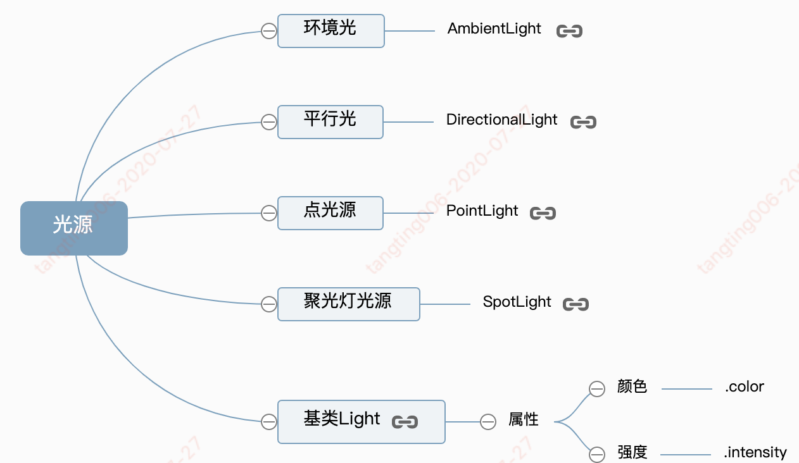

#### 2.5.1. 环境光AmbientLight

环境光是没有特定方向的光源，主要是均匀整体改变Threejs物体表面的明暗效果，这一点和具有方向的光源不同，比如点光源可以让物体表面不同区域明暗程度不同。

```js
//环境光:环境光颜色RGB成分分别和物体材质颜色RGB成分分别相乘
var ambient = new THREE.AmbientLight(0x444444);
scene.add(ambient);//环境光对象添加到scene场景中
```

#### 2.5.2. 点光源PointLight

点光源就像生活中的白炽灯，光线沿着发光核心向外发散，同一平面的不同位置与点光源光线入射角是不同的，点光源照射下，同一个平面不同区域是呈现出不同的明暗效果。  

和环境光不同，环境光不需要设置光源位置，而点光源需要设置位置属性.position，光源位置不同，物体表面被照亮的面不同，远近不同因为衰减明暗程度不同。  

你可以把案例源码中点光源位置从(400, 200, 300)位置改变到(-400, -200, -300)，你会发现网格模型被照亮的位置从前面变到了后面，这很正常，光源只能照亮面对着光源的面，背对着光源的无法照射到，颜色会比较暗。  

```js
//点光源
var point = new THREE.PointLight(0xffffff);
//设置点光源位置，改变光源的位置
point.position.set(400, 200, 300);
scene.add(point);
```

#### 2.5.3. 平行光DirectionalLight

对于一个平面而言，平面不同区域接收到平行光的入射角一样。  

点光源因为是向四周发散，所以设置好位置属性.position就可以确定光线和物体表面的夹角，对于平行光而言,主要是确定光线的方向,光线方向设定好了，光线的与物体表面入射角就确定了，仅仅设置光线位置是不起作用的。

在三维空间中为了确定一条直线的方向只需要确定直线上两个点的坐标即可，所以Threejs平行光提供了位置.position和目标.target两个属性来一起确定平行光方向。目标.target的属性值可以是Threejs场景中任何一个三维模型对象，比如一个网格模型Mesh，这样Threejs计算平行光照射方向的时候，会通过自身位置属性.position和.target表示的物体的位置属性.position计算出来。  

```js
// 平行光
var directionalLight = new THREE.DirectionalLight(0xffffff, 1);
// 设置光源的方向：通过光源position属性和目标指向对象的position属性计算
directionalLight.position.set(80, 100, 50);
// 方向光指向对象网格模型mesh2，可以不设置，默认的位置是0,0,0
directionalLight.target = mesh2;
scene.add(directionalLight);
```

平行光如果不设置.position和.target属性，光线默认从上往下照射，也就是可以认为(0,1,0)和(0,0,0)两个坐标确定的光线方向。  

注意一点平行光光源的位置属性.position并不表示平行光从这个位置向远处照射，.position属性只是用来确定平行光的照射方向，平行光你可以理解为太阳光，从无限远处照射过来。  

#### 2.5.4. 聚光源SpotLight

聚光源可以认为是一个沿着特定方会逐渐发散的光源，照射范围在三维空间中构成一个圆锥体。通过属性.angle可以设置聚光源发散角度，聚光源照射方向设置和平行光光源一样是通过位置.position和目标.target两个属性来实现。  

```js
// 聚光光源
var spotLight = new THREE.SpotLight(0xffffff);
// 设置聚光光源位置
spotLight.position.set(200, 200, 200);
// 聚光灯光源指向网格模型mesh2
spotLight.target = mesh2;
// 设置聚光光源发散角度
spotLight.angle = Math.PI / 6
scene.add(spotLight);//光对象添加到scene场景中
```

#### 2.5.5. 光照计算算法

Threejs在渲染的时候网格模型材质的颜色值mesh.material.color和光源的颜色值light.color会进行相乘，简单说就是RGB三个分量分别相乘。  

平行光漫反射简单数学模型：漫反射光的颜色 = 网格模型材质颜色值 x 光线颜色 x 光线入射角余弦值  

漫反射数学模型RGB分量表示：(R2,G2,B2) = (R1,G1,B1) x (R0,G0,B0) x cosθ  

R2 = R1 * R0 * cosθ  
G2 = G1 * G0 * cosθ  
B2 = B1 * B0 * cosθ  

比如把网格模型的颜色设置为白色0xffffff,也就意味着可以反射任意光照颜色，然后把环境光和点光源只保留红色成分，绿色和蓝色成分都设置为0。你可以看到网格模型会把渲染为红色。  

```js
// 网格模型材质设置为白色
var geometry = new THREE.BoxGeometry(100, 100, 100); //
var material = new THREE.MeshLambertMaterial({
  color: 0xffffff
});
var mesh = new THREE.Mesh(geometry, material);
scene.add(mesh);

//环境光   环境光颜色RGB成分分别和物体材质颜色RGB成分分别相乘
var ambient = new THREE.AmbientLight(0x440000);
scene.add(ambient);//环境光对象添加到scene场景中
//点光源
var point = new THREE.PointLight(0xff0000);
//设置点光源位置  光源对象和模型对象的position属性一样是Vector3对象
//PointLight的基类是Light  Light的基类是Object3D  点光源对象继承Object3D对象的位置属性position
point.position.set(400, 200, 300);
scene.add(point);
```

把网格模型设置为纯蓝色0x0000ff,光源颜色只保留红色成分不变，你可以看到网格模型的渲染效果是黑色，因为这两个颜色相乘总有一个RGB分量为0，相乘的结果是0x00000,也就是黑色。

#### 2.5.6. 平行光投影计算代码

Three.js物体投影模拟计算主要设置三部分，一个是设置产生投影的模型对象，一个是设置接收投影效果的模型，最后一个是光源对象本身的设置，光源如何产生投影。  

```js
//创建一个平面几何体作为投影面
var planeGeometry = new THREE.PlaneGeometry(300, 200);
var planeMaterial = new THREE.MeshLambertMaterial({
  color: 0x999999
});
// 平面网格模型作为投影面
var planeMesh = new THREE.Mesh(planeGeometry, planeMaterial);
scene.add(planeMesh); //网格模型添加到场景中
planeMesh.rotateX(-Math.PI / 2); //旋转网格模型
planeMesh.position.y = -50; //设置网格模型y坐标
// 设置接收阴影的投影面
planeMesh.receiveShadow = true;

// 方向光
var directionalLight = new THREE.DirectionalLight(0xffffff, 1);
// 设置光源位置
directionalLight.position.set(60, 100, 40);
scene.add(directionalLight);
// 设置用于计算阴影的光源对象
directionalLight.castShadow = true;
// 设置计算阴影的区域，最好刚好紧密包围在对象周围
// 计算阴影的区域过大：模糊  过小：看不到或显示不完整
directionalLight.shadow.camera.near = 0.5;
directionalLight.shadow.camera.far = 300;
directionalLight.shadow.camera.left = -50;
directionalLight.shadow.camera.right = 50;
directionalLight.shadow.camera.top = 200;
directionalLight.shadow.camera.bottom = -100;
// 设置mapSize属性可以使阴影更清晰，不那么模糊
// directionalLight.shadow.mapSize.set(1024,1024)
console.log(directionalLight.shadow.camera);
```

.castShadow属性值是布尔值，默认false，用来设置一个模型对象是否在光照下产生投影效果。  

mesh.castShadow = true;  

.receiveShadow属性值是布尔值，默认false，用来设置一个模型对象是否在光照下接受其它模型的投影效果。  

planeMesh.receiveShadow = true;  

光源.castShadow属性  
如果属性设置为 true， 光源将投射动态阴影. 警告: 这需要很多计算资源，需要调整以使阴影看起来正确.  

directionalLight.castShadow = true;

#### 2.5.7. 聚光光源投影计算

下面代码是聚光光源的设置，其它部分代码和平行光一样。

```js
// 聚光光源
var spotLight = new THREE.SpotLight(0xffffff);
// 设置聚光光源位置
spotLight.position.set(50, 90, 50);
// 设置聚光光源发散角度
spotLight.angle = Math.PI /6
scene.add(spotLight); //光对象添加到scene场景中
// 设置用于计算阴影的光源对象
spotLight.castShadow = true;
// 设置计算阴影的区域，注意包裹对象的周围
spotLight.shadow.camera.near = 1;
spotLight.shadow.camera.far = 300;
spotLight.shadow.camera.fov = 20;
```

LightShadow属性.camera  
观察光源的相机对象. 从光的角度来看，以相机对象的观察位置和方向来判断，其他物体背后的物体将处于阴影中。  

```js
// 聚光源设置
spotLight.shadow.camera.near = 1;
spotLight.shadow.camera.far = 300;
spotLight.shadow.camera.fov = 20;
```

LightShadow属性.mapSize  
定义阴影纹理贴图宽高尺寸的一个二维向量Vector2.  

较高的值会以计算时间为代价提供更好的阴影质量. 宽高分量值必须是2的幂, 直到给定设备的WebGLRenderer.capabilities.maxTextureSize, 尽管宽度和高度不必相同 (例如，(512, 1024)是有效的). 默认值为 ( 512, 512 ).  

```js
directionalLight.shadow.mapSize.set(1024,1024)
```

LightShadow属性.map  
该属性的值是WebGL渲染目标对象WebGLRenderTarget，使用内置摄像头生成的深度图; 超出像素深度的位置在阴影中。 在渲染期间内部计算。

### 2.6. 层级模型、树结构

所谓层级模型，比如一个机器人，人头、胳膊都是人的一部分，眼睛是头的一部分，手是个胳膊的一部分，手指是手的一部分...这样的话就构成一个一个层级结构或者说树结构。  

#### 2.6.1. 组对象Group、层级模型

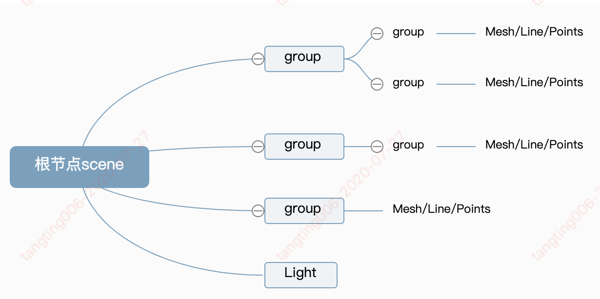

下面代码代码创建了两个网格模型mesh1、mesh2，通过THREE.Group类创建一个组对象group,然后通过add方法把网格模型mesh1、mesh2作为设置为组对象group的子对象，然后在通过执行scene.add(group)把组对象group作为场景对象的scene的子对象。也就是说场景对象是scene是group的父对象，group是mesh1、mesh2的父对象。这样就构成了一个三层的层级结构，

```js
//创建两个网格模型mesh1、mesh2
var geometry = new THREE.BoxGeometry(20, 20, 20);
var material = new THREE.MeshLambertMaterial({color: 0x0000ff});
var group = new THREE.Group();
var mesh1 = new THREE.Mesh(geometry, material);
var mesh2 = new THREE.Mesh(geometry, material);
mesh2.translateX(25);
//把mesh1型插入到组group中，mesh1作为group的子对象
group.add(mesh1);
//把mesh2型插入到组group中，mesh2作为group的子对象
group.add(mesh2);
//把group插入到场景中作为场景子对象
scene.add(group);
```

网格模型mesh1、mesh2作为设置为父对象group的子对象，如果父对象group进行旋转、缩放、平移变换，子对象同样跟着变换，就像你的头旋转了，眼睛会跟着头旋转。

```js
//沿着Y轴平移mesh1和mesh2的父对象，mesh1和mesh2跟着平移
group.translateY(100);

//父对象缩放，子对象跟着缩放
group.scale.set(4,4,4);

//父对象旋转，子对象跟着旋转
group.rotateY(Math.PI/6)
```

1. 查看子对象.children  
Threejs场景对象Scene、组对象Group都有一个子对象属性.children,通过该属性可以访问父对象的子对象，子对象属性.children的值是数组，所有子对象是数组的值

2. 场景对象结构:scene.children  

3. .add()方法  

父对象执行.add()方法的本质就是把参数中的子对象添加到自身的子对象属性.children中。  

.add()方法可以单独插入一个对象，也可以同时插入多个子对象。  

```js
group.add(mesh1);
group.add(mesh2);

group.add(mesh1,mesh2);
```

4. .remove()方法  

删除父对象中的一个子对象。 一个对象的全部子对象可以通过该对象的.children()属性访问获得，执行该对象的删除方法.remove()改变的都是父对象的.children()属性  

```js
// 一次删除场景中多个对象
scene.remove(light,group)
```

#### 2.6.2. 层级模型节点命名、查找、遍历

1. 模型命名(.name属性)  

在层级模型中可以给一些模型对象通过.name属性命名进行标记。

```js
group.add(Mesh)
// 网格模型命名
Mesh.name = "眼睛"
// mesh父对象对象命名
group.name = "头"
```

2. 递归遍历方法.traverse()

Threejs层级模型就是一个树结构，可以通过递归遍历的算法去遍历Threejs一个模型对象的所有后代  

```js
scene.traverse(function(obj) {
  if (obj.type === "Group") {
    console.log(obj.name);
  }
  if (obj.type === "Mesh") {
    console.log('  ' + obj.name);
    obj.material.color.set(0xffff00);
  }
  if (obj.name === "左眼" | obj.name === "右眼") {
    obj.material.color.set(0x000000)
  }
  // 打印id属性
  console.log(obj.id);
  // 打印该对象的父对象
  console.log(obj.parent);
  // 打印该对象的子对象
  console.log(obj.children);
})
```

3. 查找某个具体的模型  

.getObjectById()、.getObjectByName()等方法  

```js
// 遍历查找scene中复合条件的子对象，并返回id对应的对象
var idNode = scene.getObjectById ( 4 );
console.log(idNode);
// 遍历查找对象的子对象，返回name对应的对象（name是可以重名的，返回第一个）
var nameNode = scene.getObjectByName ( "左腿" );
nameNode.material.color.set(0xff0000);
```

#### 2.6.3. 坐标

可以直接访问模型的位置属性.position获得模型在本地坐标系或者说模型坐标系下的三维坐标，通过模型的.getWorldPosition()方法获得该模型在世界坐标下的三维坐标。  

1. .getWorldPosition()方法  

```js
// 声明一个三维向量用来保存世界坐标
var worldPosition = new THREE.Vector3();
// 执行getWorldPosition方法把模型的世界坐标保存到参数worldPosition中
mesh.getWorldPosition(worldPosition);
```

2. 世界坐标系  

网格模型mesh通过位置属性.position返回的坐标x分量是50，通过.getWorldPosition()返回的坐标x分量是100，也就是说mesh的是世界坐标是mesh位置属性.position和mesh父对象group位置属性.position的累加。  

```js
var mesh = new THREE.Mesh(geometry, material);
// mesh的本地坐标设置为(50, 0, 0)
mesh.position.set(50, 0, 0);
var group = new THREE.Group();
// group本地坐标设置和mesh一样设置为(50, 0, 0)
// mesh父对象设置position会影响得到mesh的世界坐标
group.position.set(50, 0, 0);
group.add(mesh);
scene.add(group);

// .position属性获得本地坐标
console.log('本地坐标',mesh.position);

// getWorldPosition()方法获得世界坐标
//该语句默认在threejs渲染的过程中执行,如果渲染之前想获得世界矩阵属性、世界位置属性等属性，需要通过代码更新
scene.updateMatrixWorld(true);
var worldPosition = new THREE.Vector3();
mesh.getWorldPosition(worldPosition);
console.log('世界坐标',worldPosition);
```

本地矩阵.materix是以本地坐标系为参考的模型矩阵，世界矩阵.matrixWorld自然就是以是世界坐标系为参照的模型矩阵.  

本地矩阵.materix是以线性代数矩阵的形式表示.position、.scale和.rotation。世界矩阵.matrixWorld自然是用矩阵的形式表示模型以及模型父对象的所有旋转缩放平移变换。  

### 2.7. 几何体对象、曲线、三维模型

#### 2.7.1. 几何体

所有几何体的基类分为Geometry和BufferGeometry两大类，两类几何体直接可以相互转化。  

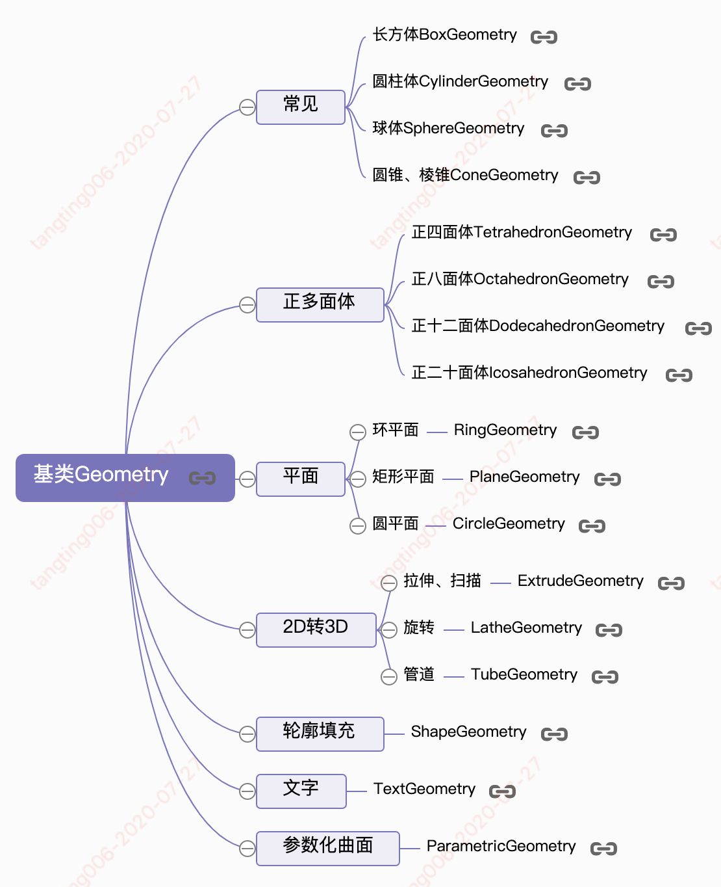

#### 2.7.2.  曲线  

曲线和几何体同样本质上都是用来生成顶点的算法，曲线主要是按照一定的规则生成一系列沿着某条轨迹线分布的顶点。

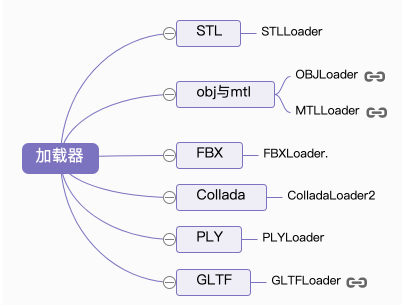

圆弧线ArcCurve

```js
ArcCurve( aX, aY, aRadius, aStartAngle, aEndAngle, aClockwise )

//参数：0, 0圆弧坐标原点x，y  100：圆弧半径    0, 2 * Math.PI：圆弧起始角度
var arc = new THREE.ArcCurve(0, 0, 100, 0, 2 * Math.PI);
```

| 参数 | 含义 |
| aX, aY | 圆弧圆心坐标 |
| aRadius | 圆弧半径 |
| aStartAngle, aEndAngle | 起始角度 |
| aClockwis | 是否顺时针绘制，默认值为false |

曲线Curve方法.getPoints()  

.getPoints()是基类Curve的方法，圆弧线ArcCurve的基类是椭圆弧线EllipseCurve,椭圆弧线的基类是曲线Curve，所以圆弧线具有Curve的方法.getPoints()。  

通过方法.getPoints()可以从圆弧线按照一定的细分精度返回沿着圆弧线分布的顶点坐标。细分数越高返回的顶点数量越多，自然轮廓越接近于圆形。方法.getPoints()的返回值是一个由二维向量Vector2或三维向量Vector3构成的数组，Vector2表示位于同一平面内的点，Vector3表示三维空间中一点。  

```js
var arc = new THREE.ArcCurve(0, 0, 100, 0, 2 * Math.PI);
//getPoints是基类Curve的方法，返回一个vector2对象作为元素组成的数组
var points = arc.getPoints(50);//分段数50，返回51个顶点
```

几何体方法.setFromPoints()  

.setFromPoints()是几何体Geometry的方法，通过该方法可以把数组points中顶点数据提取出来赋值给几何体的顶点位置属性geometry.vertices，数组points的元素是二维向量Vector2或三维向量Vector3。  

BufferGeometry和Geometry一样具有方法.setFromPoints()，不过区别是提取顶点数据后赋值给geometry.attributes.position属性。  

```js
// setFromPoints方法从points中提取数据改变几何体的顶点属性vertices
geometry.setFromPoints(points);
console.log(geometry.vertices);
// 如果几何体是BufferGeometry，setFromPoints方法改变的是.attributes.position属性
// console.log(geometry.attributes.position);
```

使用threejs的API圆弧线ArcCurve绘制一个圆弧轮廓

```js
//参数：0, 0圆弧坐标原点x，y  100：圆弧半径    0, 2 * Math.PI：圆弧起始角度
var arc = new THREE.ArcCurve(0, 0, 100, 0, 2 * Math.PI);
//getPoints是基类Curve的方法，返回一个vector2对象作为元素组成的数组
var points = arc.getPoints(50);//分段数50，返回51个顶点
// setFromPoints方法从points中提取数据改变几何体的顶点属性vertices
geometry.setFromPoints(points);
```

通过三角函数计算生成圆弧线上的顶点, 曲线API本质上就是通过某种算法得到了沿着特定轨迹的顶点数据。

```js
var R = 100; //圆弧半径
var N = 50; //分段数量
// 批量生成圆弧上的顶点数据
for (var i = 0; i < N; i++) {
  var angle = 2 * Math.PI / N * i;
  var x = R * Math.sin(angle);
  var y = R * Math.cos(angle);
  geometry.vertices.push(new THREE.Vector3(x, y, 0));
}
// 插入最后一个点，line渲染模式下，产生闭合效果
geometry.vertices.push(geometry.vertices[0])
```

#### 2.7.3. 样条曲线、贝赛尔曲线

样条曲线CatmullRomCurve3  

在三维空间中设置5个顶点，输入三维样条曲线CatmullRomCurve3作为参数，然后返回更多个顶点，通过返回的顶点数据，构建一个几何体，通过Line可以绘制出来一条沿着5个顶点的光滑样条曲线。  

```js
// 三维样条曲线  Catmull-Rom算法
var curve = new THREE.CatmullRomCurve3([
  new THREE.Vector3(-50, 20, 90),
  new THREE.Vector3(-10, 40, 40),
  new THREE.Vector3(0, 0, 0),
  new THREE.Vector3(60, -60, 0),
  new THREE.Vector3(70, 0, 80)
]);
//getPoints是基类Curve的方法，返回一个vector3对象作为元素组成的数组
var points = curve.getPoints(100); //分段数100，返回101个顶点
// setFromPoints方法从points中提取数据改变几何体的顶点属性vertices
geometry.setFromPoints(points);
```

贝塞尔曲线  QuadraticBezierCurve3  

贝塞尔曲线和样条曲线不同，多了一个控制点概念。二次贝赛尔曲线的参数p1、p3是起始点，p2是控制点，控制点不在贝塞尔曲线上。  

```js
var p1 = new THREE.Vector3(-80, 0, 0);
var p2 = new THREE.Vector3(20, 100, 0);
var p3 = new THREE.Vector3(80, 0, 0);
// 三维二次贝赛尔曲线
var curve = new THREE.QuadraticBezierCurve3(p1, p2, p3)

// 二次贝赛尔曲线的参数p1、p4是起始点，p2、p3是控制点，控制点不在贝塞尔曲线上。
var p1 = new THREE.Vector3(-80, 0, 0);
var p2 = new THREE.Vector3(-40, 100, 0);
var p3 = new THREE.Vector3(40, 100, 0);
var p4 = new THREE.Vector3(80, 0, 0);
// 三维三次贝赛尔曲线
var curve = new THREE.CubicBezierCurve3(p1, p2, p3, p4);
```

#### 2.7.4. 多个线条组合曲线CurvePath

通过组合曲线CurvePath可以把多个圆弧线、样条曲线、直线等多个曲线合并成一个曲线。

```js
// 绘制一个U型轮廓
var R = 80; //圆弧半径
var arc = new THREE.ArcCurve(0, 0, R, 0, Math.PI, true);
// 半圆弧的一个端点作为直线的一个端点
var line1 = new THREE.LineCurve(new THREE.Vector2(R, 200, 0), new THREE.Vector2(R, 0, 0));
var line2 = new THREE.LineCurve(new THREE.Vector2(-R, 0, 0), new THREE.Vector2(-R, 200, 0));
// 创建组合曲线对象CurvePath
var CurvePath = new THREE.CurvePath();
// 把多个线条插入到CurvePath中
CurvePath.curves.push(line1, arc, line2);
//分段数200
var points = CurvePath.getPoints(200);
// setFromPoints方法从points中提取数据改变几何体的顶点属性vertices
geometry.setFromPoints(points);
```

#### 2.7.5. 曲线路径管道成型TubeGeometry

TubeGeometry的功能就是通过一条曲线生成一个圆管。它的本质就是以曲线上顶点为基准，生成一系列曲线等径分布的顶点数据  

构造函数格式：TubeGeometry(path, tubularSegments, radius, radiusSegments, closed)  

| 参数 | 值 |
| path | 扫描路径，基本类是Curve的路径构造函数 |
| tubularSegments | 路径方向细分数，默认64 |
| radius | 管道半径，默认1 |
| radiusSegments | 管道圆弧细分数，默认8 |
| closed | Boolean值，管道是否闭合 |

```js
//创建管道成型的路径(3D样条曲线)
var path = new THREE.CatmullRomCurve3([
  new THREE.Vector3(-10, -50, -50),
  new THREE.Vector3(10, 0, 0),
  new THREE.Vector3(8, 50, 50),
  new THREE.Vector3(-5, 0, 100)
]);
// path:路径   40：沿着轨迹细分数  2：管道半径   25：管道截面圆细分数
var geometry = new THREE.TubeGeometry(path, 40, 2, 25);
```

CurvePath多段路径生成管道案例  
通过下面代码创建了一段样条曲线和两条直线拼接成的路径，然后通过曲线路径CurvePath把样条曲线和料条曲线合并成为一条路径。  

```js
// 创建多段线条的顶点数据
var p1 = new THREE.Vector3(-85.35, -35.36)
var p2 = new THREE.Vector3(-50, 0, 0);
var p3 = new THREE.Vector3(0, 50, 0);
var p4 = new THREE.Vector3(50, 0, 0);
var p5 = new THREE.Vector3(85.35, -35.36);
// 创建线条一：直线
let line1 = new THREE.LineCurve3(p1, p2);
// 重建线条2：三维样条曲线
var curve = new THREE.CatmullRomCurve3([p2, p3, p4]);
// 创建线条3：直线
let line2 = new THREE.LineCurve3(p4, p5);
var CurvePath = new THREE.CurvePath(); // 创建CurvePath对象
CurvePath.curves.push(line1, curve, line2); // 插入多段线条
//通过多段曲线路径创建生成管道，CCurvePath：管道路径
var geometry2 = new THREE.TubeGeometry(CurvePath, 100, 5, 25, false);
```

#### 2.7.6. 旋转造型LatheGeometry

构造函数LatheGeometry()， LatheGeometry可以利用已有的二维数据生成三维顶点数据，二维数据可以通过二维向量对象Vector2定义，也可以通过3D曲线或2D线条轮廓生成。 LatheGeometry的二维坐标数据默认绕y轴旋转。  

格式：LatheGeometry(points, segments, phiStart, phiLength)  

| 参数 | 值 |
| points | Vector2表示的坐标数据组成的数组 |
| segments | 圆周方向细分数，默认12 |
| phiStart | 开始角度,默认0 |
| phiLength | 旋转角度，默认2π |

```js
var points = [
  new THREE.Vector2(50, 60),
  new THREE.Vector2(25, 0),
  new THREE.Vector2(50, -60)
];
var geometry = new THREE.LatheGeometry(points, 30);
var material = new THREE.MeshPhongMaterial({
  color: 0x0000ff, //三角面颜色
  side: THREE.DoubleSide //两面可见
}); //材质对象
material.wireframe = true; //线条模式渲染(查看细分数)
var mesh = new THREE.Mesh(geometry, material); //旋转网格模型对象
scene.add(mesh); //旋转网格模型添加到场景中
```

样条曲线插值计算  

借助Shape对象的方法.splineThru()，把上面的三个顶点进行样条插值计算， 可以得到一个光滑的旋转曲面。  

shape.getPoints(20)的作用是利用已有的顶点插值计算出新的顶点，两个顶点之间插值计算出20个顶点，如果细分数是1不是20，相当于不进行插值计算， 插值计算的规则通过Shape对象的方法.splineThru()定义，几何曲线的角度描述，splineThru的作用就是创建一个样条曲线，除了样条曲线还可以使用贝赛尔等曲线进行插值计算。

```js
var shape = new THREE.Shape();//创建Shape对象
var points = [//定位定点
    new THREE.Vector2(50,60),
    new THREE.Vector2(25,0),
    new THREE.Vector2(50,-60)
];
shape.splineThru(points);//顶点带入样条插值计算函数
var splinePoints = shape.getPoints(20);//插值计算细分数20
var geometry = new THREE.LatheGeometry(splinePoints,30);//旋转造型
```

#### 2.7.7. Shape对象和轮廓填充ShapeGeometry

1. 填充顶点构成的轮廓  

通过下面代码定义了6个顶点坐标，也可以说是5个，最后一个和第一个是重合的，构成一个五边形区域。然后使用这一组二维顶点坐标作为Shape的参数构成一个五边形轮廓。把五边形轮廓Shape作为ShapeGeometry的参数，可以根据轮廓坐标计算出一系列三角形面填充轮廓，形成一个平面几何体。  

```js
var points = [
  new THREE.Vector2(-50, -50),
  new THREE.Vector2(-60, 0),
  new THREE.Vector2(0, 50),
  new THREE.Vector2(60, 0),
  new THREE.Vector2(50, -50),
  new THREE.Vector2(-50, -50),
]
// 通过顶点定义轮廓
var shape = new THREE.Shape(points);
// shape可以理解为一个需要填充轮廓
// 所谓填充：ShapeGeometry算法利用顶点计算出三角面face3数据填充轮廓
var geometry = new THREE.ShapeGeometry(shape, 25);
```

```js
// 一个外轮廓圆弧嵌套三个内圆弧轮廓
var shape = new THREE.Shape(); //Shape对象
//外轮廓
shape.arc(0, 0, 100, 0, 2 * Math.PI);
// 内轮廓1
var path1 = new THREE.Path();
path1.arc(0, 0, 40, 0, 2 * Math.PI);
// 内轮廓2
var path2 = new THREE.Path();
path2.arc(80, 0, 10, 0, 2 * Math.PI);
// 内轮廓3
var path3 = new THREE.Path();
path3.arc(-80, 0, 10, 0, 2 * Math.PI);
//三个内轮廓分别插入到holes属性中
shape.holes.push(path1, path2, path3);
```

### 2.8. 纹理贴图

#### 2.8.1. 创建纹理贴图

通过纹理贴图加载器TextureLoader的load()方法加载一张图片可以返回一个纹理对象Texture，纹理对象Texture可以作为模型材质颜色贴图.map属性的值。  

材质的颜色贴图属性.map设置后，模型会从纹理贴图上采集像素值，这时候一般来说不需要在设置材质颜色.color。.map贴图之所以称之为颜色贴图就是因为网格模型会获得颜色贴图的颜色值RGB。  

```js
// 纹理贴图映射到一个矩形平面上
var geometry = new THREE.PlaneGeometry(204, 102); //矩形平面
// TextureLoader创建一个纹理加载器对象，可以加载图片作为几何体纹理
var textureLoader = new THREE.TextureLoader();
// 执行load方法，加载纹理贴图成功后，返回一个纹理对象Texture
textureLoader.load('Earth.png', function(texture) {
  var material = new THREE.MeshLambertMaterial({
    // color: 0x0000ff,
    // 设置颜色纹理贴图：Texture对象作为材质map属性的属性值
    map: texture,//设置颜色贴图属性值
  }); //材质对象Material
  var mesh = new THREE.Mesh(geometry, material); //网格模型对象Mesh
  scene.add(mesh); //网格模型添加到场景中

  //纹理贴图加载成功后，调用渲染函数执行渲染操作
  render();
})
```

> **纹理对象Texture**  

通过图片加载器ImageLoader可以加载一张图片，所谓纹理对象Texture简单地说就是，纹理对象Texture的.image属性值是一张图片。  

#### 2.8.2. 几何体顶点纹理坐标UV

##### 两组UV坐标

几何体有两组UV坐标，第一组组用于.map、.normalMap、.specularMap等贴图的映射，第二组用于阴影贴图.lightMap的映射.

##### 修改纹理坐标

几何体表面所有位置全部对应贴图(0.4,0.4)坐标位置的像素值，这样话网格模型不会显示完整的地图，而是显示采样点纹理坐标(0.4,0.4)对应的RGB值。

```js
//矩形平面，细分数默认1，即2个三角形拼接成一个矩形
var geometry = new THREE.PlaneGeometry(204, 102);
...
/**
 * 遍历uv坐标
 */
geometry.faceVertexUvs[0].forEach(elem => {
  elem.forEach(Vector2 => {
    // 所有的UV坐标全部设置为一个值
    Vector2.set(0.4,0.4);
  });
});
```

原来几何体平面默认是两个三角形构成，把细分数设置为4，三角形数量变为16个。

```js
// 矩形平面 设置细分数4,4
var geometry = new THREE.PlaneGeometry(204, 102, 4, 4);
...
/**
 * 局部三角面显示完整纹理贴图
 */
var t0 = new THREE.Vector2(0, 1); //图片左下角
var t1 = new THREE.Vector2(0, 0); //图片右下角
var t2 = new THREE.Vector2(1, 0); //图片右上角
var t3 = new THREE.Vector2(1, 1); //图片左上角
var uv1 = [t0, t1, t3]; //选中图片一个三角区域像素——用于映射到一个三角面
var uv2 = [t1, t2, t3]; //选中图片一个三角区域像素——用于映射到一个三角面
// 设置第五、第六个三角形面对应的纹理坐标
geometry.faceVertexUvs[0][4] = uv1
geometry.faceVertexUvs[0][5] = uv2
```

#### 2.8.3. 数组材质、材质索引.materialIndex

> 数组材质  

所谓数组材质就是多个材质对象构成一个数组作为模型对象的材质。

```js
var geometry = new THREE.BoxGeometry(100, 100, 100); //立方体
// var geometry = new THREE.PlaneGeometry(204, 102, 4, 4); //矩形平面
// var geometry = new THREE.SphereGeometry(60, 25, 25); //球体
// var geometry = new THREE.CylinderGeometry(60, 60, 25,25); //圆柱
//
// 材质对象1
var material_1 = new THREE.MeshPhongMaterial({
  color: 0xffff3f
})
var textureLoader = new THREE.TextureLoader(); // 纹理加载器
var texture = textureLoader.load('Earth.png'); // 加载图片，返回Texture对象
// 材质对象2
var material_2 = new THREE.MeshLambertMaterial({
  map: texture, // 设置纹理贴图
  // wireframe:true,
});
// 设置材质数组
var materialArr = [material_2, material_1, material_1, material_1, material_1, material_1];

// 设置数组材质对象作为网格模型材质参数
var mesh = new THREE.Mesh(geometry, materialArr); //网格模型对象Mesh
scene.add(mesh); //网格模型添加到场景中
```

#### 2.8.4. 纹理对象Texture阵列、偏移、旋转

1. 阵列  

纹理贴图阵列映射。

```js
var texture = textureLoader.load('p1.png');
// 设置阵列模式   默认ClampToEdgeWrapping  RepeatWrapping：阵列  镜像阵列：MirroredRepeatWrapping
texture.wrapS = THREE.RepeatWrapping;
texture.wrapT = THREE.RepeatWrapping;
// uv两个方向纹理重复数量
texture.repeat.set(4, 2);
```

2. 偏移

```js
texture.offset = new THREE.Vector2(0.3, 0.1)
```

3. 纹理旋转

```js
texture.rotation = Math.PI/4;
```

#### 2.8.5. 数据纹理对象DataTexture

像素值包含RGB三个分量的图片格式有.jpg、.BMP等格式，通过WebGL原生API加载解析这些类型格式的图片需要设置gl.RGB，对于Threejs而言对WebGL进行封装了，gl.RGB对应的设置是THREE.RGBFormat  

```js
var geometry = new THREE.PlaneGeometry(128, 128); //矩形平面
/**
 * 创建纹理对象的像素数据
 */
var width = 32; //纹理宽度
var height = 32; //纹理高度
var size = width * height; //像素大小
var data = new Uint8Array(size * 3); //size*3：像素在缓冲区占用空间
for (let i = 0; i < size * 3; i += 3) {
  // 随机设置RGB分量的值
  data[i] = 255 * Math.random()
  data[i + 1] = 255 * Math.random()
  data[i + 2] = 255 * Math.random()
}
// 创建数据文理对象   RGB格式：THREE.RGBFormat
var texture = new THREE.DataTexture(data, width, height, THREE.RGBFormat);
texture.needsUpdate = true; //纹理更新
//打印纹理对象的image属性
// console.log(texture.image);

var material = new THREE.MeshPhongMaterial({
  map: texture, // 设置纹理贴图
}); //材质对象Material
var mesh = new THREE.Mesh(geometry, material);
```

#### 2.8.6. 凹凸贴图bumpMap和法线贴图.normalMap,光照贴图添加阴影(·lightMap),高光贴图(.specularMap),环境贴图(.envMap)

法线贴图  

```js
// TextureLoader创建一个纹理加载器对象，可以加载图片作为几何体纹理
var textureLoader = new THREE.TextureLoader();
// 加载法线贴图
var textureNormal = textureLoader.load('./xx.jpg');
var material = new THREE.MeshPhongMaterial({
  color: 0xff0000,
  normalMap: textureNormal, //法线贴图
  //设置深浅程度，默认值(1,1)。
  normalScale: new THREE.Vector2(3, 3),
}); //材质对象Material
var mesh = new THREE.Mesh(geometry, material); //网格模型对象Mesh
```

凹凸贴图  

```js
var textureLoader = new THREE.TextureLoader();
// 加载颜色纹理贴图
var texture = textureLoader.load('./xx.jpg');
// 加载凹凸贴图
var textureBump = textureLoader.load('./xx.jpg');
var material = new THREE.MeshPhongMaterial({
  map: texture,// 普通纹理贴图
  bumpMap:textureBump,//凹凸贴图
  bumpScale:3,//设置凹凸高度，默认值1。
}); //材质对象Material
```

光照贴图添加阴影  

一般Threejs加载外部模型的光照贴图·lightMap，三维模型加载器可以自动设置，不需要程序员通过代码去设置，更好理解光照贴图·lightMap，这里就通过Three.js代码设置场景模型的阴影贴图·lightMap。  

```js
//创建一个平面几何体作为投影面
var planeGeometry = new THREE.PlaneGeometry(300, 200);

planeGeometry.faceVertexUvs[1] = planeGeometry.faceVertexUvs[0];
var textureLoader = new THREE.TextureLoader();
// 加载光照贴图
var textureLight = textureLoader.load('shadow.png');
var planeMaterial = new THREE.MeshLambertMaterial({
  color: 0x999999,
  lightMap:textureLight,// 设置光照贴图
  // lightMapIntensity:0.5,//烘培光照的强度. 默认 1.
});
var planeMesh = new THREE.Mesh(planeGeometry, planeMaterial); //网格模型对象Mesh
...
```

高光贴图(.specularMap)  

高光网格材质MeshPhongMaterial具有高光属性.specular,如果一个网格模型Mesh都是相同的材质并且表面粗糙度相同,或者说网格模型外表面所有不同区域的镜面反射能力相同，可以直接设置材质的高光属性.specular。如果一个网格模型表示一个人，那么人的不同部位高光程度是不同的，不可能直接通过.specular属性来描述，在这种情况通过高光贴图.specularMap的RGB值来描述不同区域镜面反射的能力，.specularMap和颜色贴图.Map一样和通过UV坐标映射到模型表面。高光贴图.specularMap不同区域像素值不同，表示网格模型不同区域的高光值不同。  

```js
// 加载纹理贴图
var texture = textureLoader.load('earth_diffuse.png');
// 加载高光贴图
var textureSpecular = textureLoader.load('earth_specular.png');
var material = new THREE.MeshPhongMaterial({
  // specular: 0xff0000,//高光部分的颜色
  shininess: 30,//高光部分的亮度，默认30
  map: texture,// 普通纹理贴图
  specularMap: textureSpecular, //高光贴图
}); //材质对象Material
```

环境贴图(.envMap)  
加环境贴图的6张纹理贴图，可以通过CubeTextureLoader类趋势线。  

```js
var geometry = new THREE.BoxGeometry(100, 100, 100); //立方体

var loader = new THREE.CubeTextureLoader();
// 所有贴图在同一目录下，可以使用该方法设置共用路径
loader.setPath('环境贴图/');
// 立方体纹理加载器返回立方体纹理对象CubeTexture
var CubeTexture = loader.load(['px.jpg', 'nx.jpg', 'py.jpg', 'ny.jpg', 'pz.jpg', 'nz.jpg']);
//材质对象Material
var material = new THREE.MeshPhongMaterial({
  //网格模型设置颜色，网格模型颜色和环境贴图会进行融合计算
  // color:0xff0000,
  envMap: CubeTexture, //设置环境贴图
  // 环境贴图反射率   控制环境贴图对被渲染三维模型影响程度
  // reflectivity: 0.1,
});
console.log(CubeTexture.image);
var mesh = new THREE.Mesh(geometry, material); //网格模型对象Mesh
scene.add(mesh); //网格模型添加到场景中
```

### 2.9. 相机对象

#### 2.9.1. 正投影相机OrthographicCamera和透视投影相机PerspectiveCamera 


